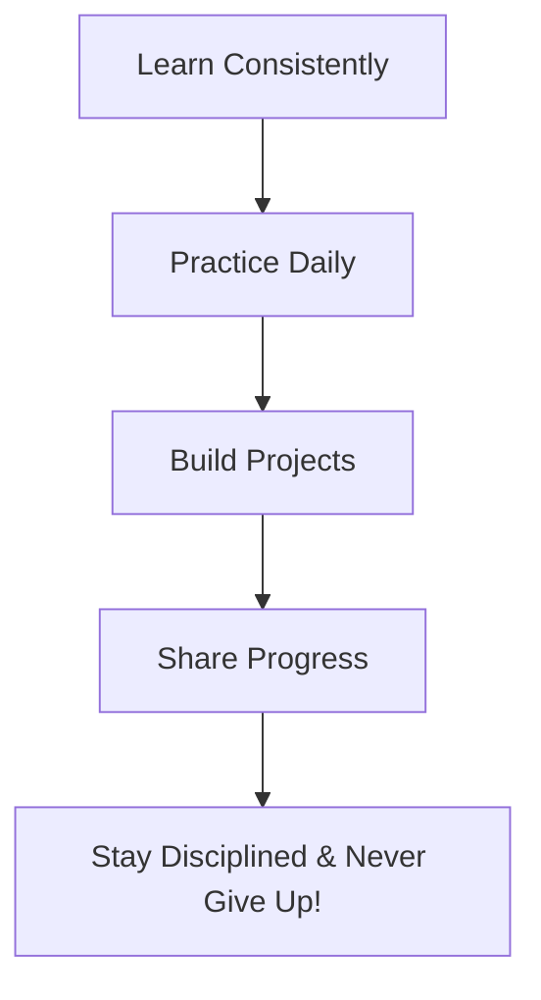

# 🌅 Day 1: Introduction to the 90 Days of DevOps Challenge

Welcome to **Day 1** of my 90 Days of DevOps journey! Today marks the official beginning of a commitment to learn, build, and grow into a skilled DevOps Engineer.

---

## 🎯 What is this Challenge?

I am committing to **90 days of DevOps**—learning, building, and improving every single day. The goal is to develop a strong foundation in modern infrastructure, automation, cloud computing, and developer operations.

> **"1% better everyday = 100% better in 90 days."**

---

## ❓ Why DevOps?

Here are my core motivations for taking on this journey:
* **Build In-Demand Skills:** Learn the tools and methodologies that power modern software delivery.
* **Work on Real-World Projects:** Apply knowledge directly to practical projects rather than just reading documentation.
* **Grow & Solve Problems:** Solve complex engineering challenges and make a positive impact.
* **Create Freedom & Opportunities:** Open doors to remote work, career advancement, and high-impact roles.
* **Personal Growth:** Most importantly, to push my limits and become the best version of myself.

---

## 📝 The Plan

To succeed in this 90-day challenge, I will follow a disciplined daily workflow:

* 📚 **Learn Consistently:** Spend dedicated time daily studying core concepts.
* 💻 **Practice Daily:** Get hands-on experience with commands and configurations.
* 🛠️ **Build Projects:** Put theory into practice by developing infrastructure projects.
* 📢 **Share Progress:** Document and push my work to GitHub to build a portfolio.
* 🔥 **Stay Disciplined:** Remember that consistency beats intensity.

---

## 💡 Today's Motto
> ### **Discipline Today, Success Tomorrow.**
> *90 days from now, I'll be proud of what I build today. **LET'S GO!***

---

### 👤 Author
* **Muhammad Rayyan**
* *Future DevOps Engineer in Progress* 👑

---

* [← Home](../README.md) | [Day 2: Linux Basics →](../day-02-linux-basics/README.md)
