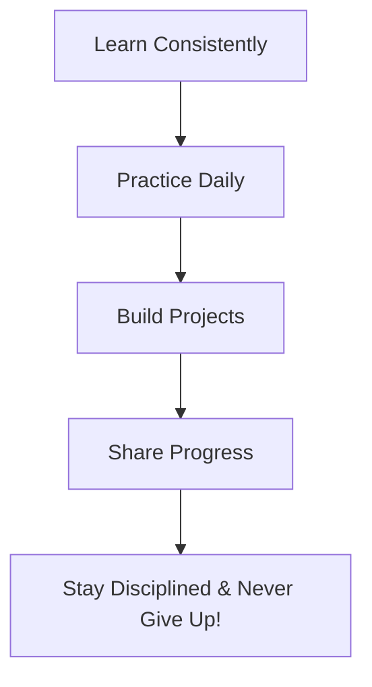
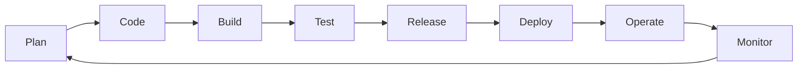

# 🌅 Day 1: Introduction to the 90 Days of DevOps Challenge

Welcome to **Day 1** of my 90 Days of DevOps journey! Today marks the official beginning of a commitment to learn, build, and grow into a skilled DevOps Engineer.

---

## 🎯 What is this Challenge?

I am committing to **90 days of DevOps**—learning, building, and improving every single day. The goal is to develop a strong foundation in modern infrastructure, automation, cloud computing, and developer operations.

> **"1% better everyday = 100% better in 90 days."**

---

## ❓ Why DevOps?

Here are my core motivations for taking on this journey:
* **Build In-Demand Skills:** Learn the tools and methodologies that power modern software delivery.
* **Work on Real-World Projects:** Apply knowledge directly to practical projects rather than just reading documentation.
* **Grow & Solve Problems:** Solve complex engineering challenges and make a positive impact.
* **Create Freedom & Opportunities:** Open doors to remote work, career advancement, and high-impact roles.
* **Personal Growth:** Most importantly, to push my limits and become the best version of myself.

---

## 📝 The Plan

To succeed in this 90-day challenge, I will follow a disciplined daily workflow:

* 📚 **Learn Consistently:** Spend dedicated time daily studying core concepts.
* 💻 **Practice Daily:** Get hands-on experience with commands and configurations.
* 🛠️ **Build Projects:** Put theory into practice by developing infrastructure projects.
* 📢 **Share Progress:** Document and push my work to GitHub to build a portfolio.
* 🔥 **Stay Disciplined:** Remember that consistency beats intensity.

---

## 💡 Today's Motto
> ### **Discipline Today, Success Tomorrow.**
> *90 days from now, I'll be proud of what I build today. **LET'S GO!***

---

## 🎓 Interview Preparation Guide: DevOps Foundations

To help prepare for interviews, here is an in-depth A-Z breakdown of foundational DevOps questions, terminology, and concepts.

### 1. What is DevOps?
DevOps is a set of practices, tools, and a cultural philosophy that automates and integrates the processes between software development (Dev) and IT/Operations (Ops) teams. It aims to shorten the systems development life cycle and provide continuous delivery with high software quality.
* **The Silo Problem:** Traditionally, Dev teams wanted change (new features) and Ops teams wanted stability (no changes that could break things). DevOps breaks down these silos so teams work together towards shared goals.

### 2. The C.A.L.M.S. Framework
This is the industry-standard acronym to explain the core tenets of DevOps:
* **C - Culture:** People and processes over tools. Fostering collaboration, transparency, and shared responsibility.
* **A - Automation:** Automate repeated manual tasks (builds, testing, deployments, backups) to reduce human error and save time.
* **L - Lean:** Minimizing waste, optimizing pipelines, and focusing on small, incremental releases (reducing batch sizes).
* **M - Measurement:** Monitoring and measuring performance metrics (deployment frequency, lead time for changes, mean time to recover (MTTR), change failure rate).
* **S - Sharing:** Sharing knowledge, tools, and success/failure stories across teams to build collective intelligence.

### 3. The DevOps Lifecycle Phases
DevOps is a continuous loop (often represented by an infinity loop). Here are the key phases:

* **Plan:** Define requirements, design architecture, and track work (using tools like Jira, Trello, or GitHub Issues).
* **Code:** Write application code and manage version control (using Git/GitHub).
* **Build:** Compile code, resolve dependencies, and package software (using tools like Maven, Gradle, or npm).
* **Test:** Run automated testing (unit, integration, security, performance) to catch bugs early.
* **Release:** Prepare the build for deployment to staging or production.
* **Deploy:** Ship the package to servers or cloud environments (using Kubernetes, Terraform, or Ansible).
* **Operate:** Maintain application uptime, manage server scaling, and handle active configuration.
* **Monitor:** Gather metrics, logs, and trace data to ensure application health and performance (using Prometheus, Grafana, ELK stack).

### 4. Continuous Integration vs. Continuous Delivery vs. Continuous Deployment

| Concept | What It Means | Manual Steps Involved |
| :--- | :--- | :--- |
| **Continuous Integration (CI)** | Automatically building and running automated tests every time code is merged into the shared main branch. | None (completely automated trigger). |
| **Continuous Delivery (CD)** | The build is automatically tested and packaged, and then staged, ready for deployment. Deployment to production requires a **manual approval** button click. | One manual step: Triggering production deployment. |
| **Continuous Deployment (CD)** | Every change that passes the automated tests is **automatically deployed** straight to production without human intervention. | None (fully automated release pipeline). |

### 5. Critical DevOps Metrics (DORA Metrics)
The DevOps Research and Assessment (DORA) group identified four key metrics that measure the performance of a software delivery team:
1. **Deployment Frequency:** How often a team successfully deploys code to production.
2. **Lead Time for Changes:** The amount of time it takes for a commit to go from being written to running in production.
3. **Mean Time to Recover (MTTR):** How long it takes to restore service after a production failure occurs.
4. **Change Failure Rate:** The percentage of deployments that cause a failure in production (requiring a hotfix or rollback).

---

### 👤 Author
* **Muhammad Rayyan**
* *Future DevOps Engineer in Progress* 👑

---

* [← Home](../README.md) | [Day 2: Linux Basics →](../day-02-linux-basics/README.md)
