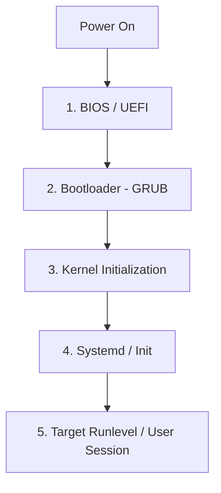

# 🐧 Day 2: Linux Basics & Foundational DevOps Concepts

On Day 2, I focused on the foundations. DevOps relies heavily on Linux systems, server administration, and secure cloud connectivity. Here are the core concepts and skills covered today.

---

## 1. UNIX vs. Linux

Understanding the origin of operating systems helps in recognizing the design decisions behind modern environments.
* **UNIX:** The original operating system developed in the **1960s** at AT&T Bell Labs. It introduced concepts like hierarchical file systems and pipes.
* **Linux:** A modern, open-source, Unix-like operating system kernel created by **Linus Torvalds** in 1991.
* **DevOps Context:** Linux is the backbone of the DevOps world, powering the vast majority of web servers, cloud infrastructure, and containerization platforms (Docker, Kubernetes).

---

## 2. Operating System, Kernel & Boot Loader

An operating system consists of multiple layers working together to translate user actions to hardware operations.

```
+---------------------------------------+
|              User / App               |
+---------------------------------------+
                   |
                   v
+---------------------------------------+
|          Operating System             |
|   +-------------------------------+   |
|   |            Kernel             |   |
|   +-------------------------------+   |
+---------------------------------------+
                   |
                   v
+---------------------------------------+
|               Hardware                |
+---------------------------------------+
```

* **Operating System (OS):** The software interface that sits between the user and the raw computer hardware.
* **Kernel:** The core of the OS. It directly interacts with the hardware, managing vital system resources (CPU, Memory, I/O devices, processes).
* **Boot Loader:** A small program that starts when the machine powers on. Its job is to initialize system memory and load the operating system Kernel into memory. An example is **GRUB** (Grand Unified Bootloader).

---

## 3. A–Z Linux Command Reference (In-Depth)

This table covers the essential commands practiced today, complete with important flags, options, and behaviors that are frequently tested in interviews.

| Command | Syntax & Core Flags | Detailed Description | Example Usage |
| :--- | :--- | :--- | :--- |
| **`pwd`** | `pwd [-P]` | **Print Working Directory.** Displays the absolute path of the current directory. `-P` prints the physical directory (resolving symlinks). | `pwd` |
| **`ls`** | `ls [options] [path]` | **List Directory Contents.** <br>`-l` (long listing format)<br>`-a` (all files, including hidden starting with `.`) <br>`-h` (human-readable sizes)<br>`-t` (sort by modification time)<br>`-S` (sort by file size) | `ls -lahS /var/log` |
| **`cd`** | `cd [dir]` | **Change Directory.** Navigates to a new folder. `cd -` toggles to the previous folder. `cd ~` or just `cd` goes home. | `cd /etc/ssh` |
| **`mkdir`** | `mkdir [-p]` | **Make Directory.** Creates folders. `-p` (parents) creates nested subdirectories if they don't exist without throwing errors. | `mkdir -p project/src/utils` |
| **`touch`** | `touch [file]` | **Touch File.** Creates an empty file if it doesn't exist, or updates the access/modification timestamps of an existing file. | `touch index.html` |
| **`cp`** | `cp [-r] [-p]` | **Copy Files/Directories.** Copies source to destination. `-r` (recursive) is required for directories. `-p` preserves file attributes (permissions, time). | `cp -rp /src /backup` |
| **`mv`** | `mv [source] [dest]` | **Move/Rename.** Moves files or directories. Also used to rename files. | `mv old.txt new.txt` |
| **`rm`** | `rm [-r] [-f] [-i]` | **Remove.** Deletes files/directories. <br>`-r` (recursive for folders)<br>`-f` (force, ignores nonexistent files and never prompts)<br>`-i` (interactive, asks before deletion) | `rm -rf /tmp/test-data` |
| **`cat`** | `cat [files]` | **Concatenate.** Concatenates and prints file contents. Often used to read small files. `-n` displays line numbers. | `cat -n config.json` |
| **`less`** | `less [file]` | **Less.** Opens a file for interactive page-by-page viewing. Navigate using `Space` (page down), `b` (page up), `g` (start of file), `G` (end of file), and `/pattern` to search. | `less /var/log/syslog` |
| **`head`** | `head [-n N]` | **Head.** Outputs the first `N` lines of a file. Default is 10 lines. | `head -n 20 error.log` |
| **`tail`** | `tail [-n N] [-f]` | **Tail.** Outputs the last `N` lines. `-f` (follow) keeps the file open and appends updates in real-time (perfect for log monitoring). | `tail -f /var/log/nginx/access.log` |
| **`grep`** | `grep [flags] "pattern" [file]`| **Global Regular Expression Print.** Searches for matching lines. <br>`-i` (case-insensitive)<br>`-v` (invert match)<br>`-n` (show line numbers)<br>`-c` (count matches)<br>`-r` (recursive directory search) | `grep -rin "error" /var/log/` |
| **`chmod`** | `chmod [mode] [file]` | **Change Permissions.** Changes file read/write/execute permissions (octal or symbolic). | `chmod 755 script.sh` |
| **`ps`** | `ps [flags]` | **Process Status.** Displays active processes. <br>`aux` (a: all users, u: user-oriented format, x: processes without controlling ttys). | `ps aux` |
| **`top`** | `top` | **Table of Processes.** Live interactive system monitor displaying CPU, memory, load averages, and active tasks. Press `q` to exit, `M` to sort by memory, `P` to sort by CPU. | `top` |

---

## 4. SSH (Secure Shell) & Key Management (In-Depth)

**SSH** is a cryptographic network protocol used for secure operating system logins over an unsecured network.

### How SSH Cryptographic Handshake Works (Interview-Ready)
1. **TCP Connection:** The client initiates a TCP connection on **Port 22** to the server.
2. **Protocol Negotiation:** The client and server agree on the SSH protocol version and cryptographic algorithms.
3. **Session Key Exchange:** Diffie-Hellman algorithm is used to securely generate a shared symmetric key, which encrypts all subsequent communications.
4. **Authentication:** The client sends their private key signature. The server verifies it against the client's public key stored in `~/.ssh/authorized_keys`.

```
Client (has Private Key)                     Server (has Public Key)
   |                                            |
   | -------- 1. TCP Port 22 Connection ------> |
   | <------- 2. Negotiate Session Key -------- |
   | -------- 3. Send Signature (Encrypted) --> |
   | <------- 4. Authentication Accepted ------ |
```

### SSH Key Management & Generation
* **Generating a secure RSA 4096-bit key pair:**
  ```bash
  ssh-keygen -t rsa -b 4096 -C "rayyan@devops"
  ```
  This creates:
  - `~/.ssh/id_rsa` (Private Key - **Permissions must be `600` or `400`**)
  - `~/.ssh/id_rsa.pub` (Public Key - Can be shared and added to the remote server's `~/.ssh/authorized_keys` file)

* **Why Private Key Permissions Matter:**
  If your private key is accessible by other users, SSH will refuse to use it and throw an error: `WARNING: UNPROTECTED PRIVATE KEY FILE!`.
  **Fix:**
  ```bash
  chmod 600 ~/.ssh/id_rsa
  ```

### Advanced: The SSH Config File (`~/.ssh/config`)
Using a configuration file allows you to map long SSH connection strings to simple aliases.
* Edit your local config file:
  ```bash
  nano ~/.ssh/config
  ```
* Add host definitions:
  ```text
  Host prod-db
      HostName 54.210.12.34
      User ubuntu
      Port 22
      IdentityFile ~/.ssh/prod-key.pem

  Host staging-web
      HostName 34.200.55.99
      User ec2-user
      IdentityFile ~/.ssh/staging-key.pem
  ```
* Connect instantly by using the host alias:
  ```bash
  ssh prod-db
  ```

---

## 5. Linux Boot Process Lifecycle (Interview Prep)

A classic interview question is: *"Describe what happens when you press the power button on a Linux machine."*



1. **BIOS / UEFI (Basic Input/Output System):** Performs a POST (Power-On Self-Test) to check system hardware (RAM, disk, CPU) and reads the boot order from non-volatile memory to locate the bootable drive.
2. **Bootloader (GRUB):** Located in the Master Boot Record (MBR) or EFI system partition. It loads the configuration menu, allows kernel parameter adjustments, and loads the selected **Kernel** and `initramfs` (initial RAM filesystem) into memory.
3. **Kernel:** Mounts the root filesystem (initially read-only via `initramfs` to load driver modules), initializes hardware interfaces, and spawns the first process (`/sbin/init` or `systemd`).
4. **Init / Systemd:** `systemd` (PID 1) starts executing, reading target files (like `multi-user.target` or `graphical.target`) to spawn all background system services, daemons, and networks.
5. **Runlevel / Target:** The system boots into the designated environment (e.g., Runlevel 3 for CLI server environment, Runlevel 5 for GUI desktop), and prompts the user for login.

---

## 6. AWS EC2 Launch Steps

Launched a virtual server in the cloud (EC2 - Elastic Compute Cloud) on AWS:
1. **Choose AMI (Amazon Machine Image):** Selected the OS template (e.g., Ubuntu Server 22.04 LTS).
2. **Select Instance Type:** Chose the hardware specifications (e.g., `t2.micro` for free tier).
3. **Configure Security Group:** Opened inbound port `22` to allow SSH access.
4. **Review & Launch:** Configured the storage, generated keys, and launched the instance.

---

## 🎓 Interview Questions & Answers

### Q1: How do you view logs in real-time on a Linux server?
Use `tail -f <log_file>`. To see the last 100 lines and follow changes:
```bash
tail -n 100 -f /var/log/nginx/error.log
```

### Q2: What is the difference between `ps aux` and `top`?
- `ps aux` is a snapshot command; it outputs the active processes at the exact moment of execution and exits.
- `top` is dynamic and interactive; it updates system metrics and process resource usage continuously in real-time.

### Q3: You try to SSH into a server and get a "Connection Timed Out" error. What are the troubleshooting steps?
1. **Network Connectivity:** Check if the host is up by running `ping <ip-address>` (if ICMP is allowed).
2. **Security Groups / Firewall:** Check the cloud provider security group (e.g., AWS Security Group) to ensure inbound traffic on port 22 is allowed from your IP address.
3. **Local Firewall:** Check local firewall configurations (e.g. `ufw` or `iptables`) on the server.
4. **SSH Daemon Status:** Ensure the SSH server daemon (`sshd`) is active on the server (`systemctl status sshd`).
5. **Routing/ISP:** Verify if your ISP or local network is blocking outbound port 22 traffic.

---

### 👤 Author
* **Muhammad Rayyan**
* *Future DevOps Engineer in Progress* 👑

---

* [← Day 1: Intro](../day-01-intro/README.md) | [Home](../README.md) | [Day 3: Advanced Linux & LVM →](../day-03-linux-advanced-lvm/README.md)
