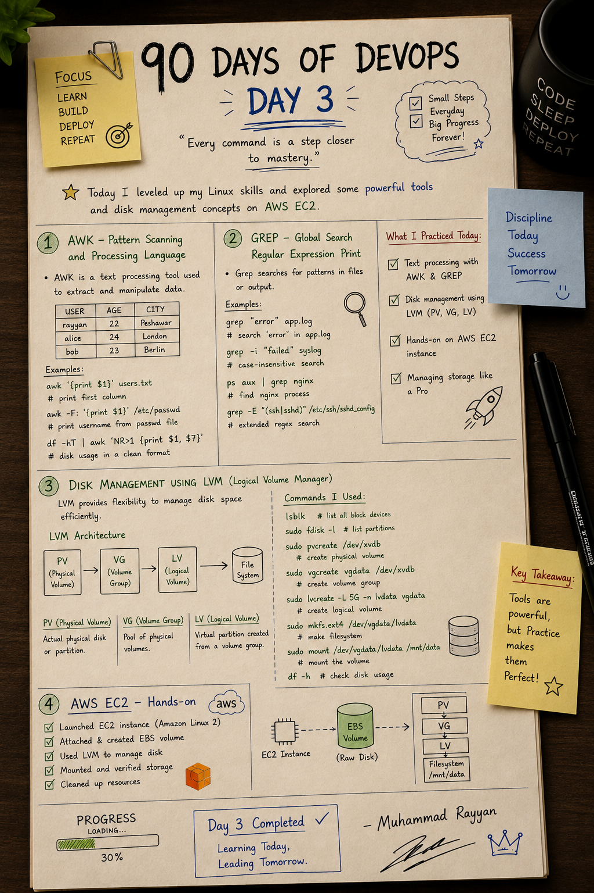
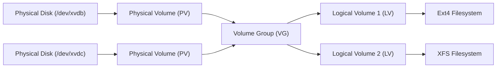
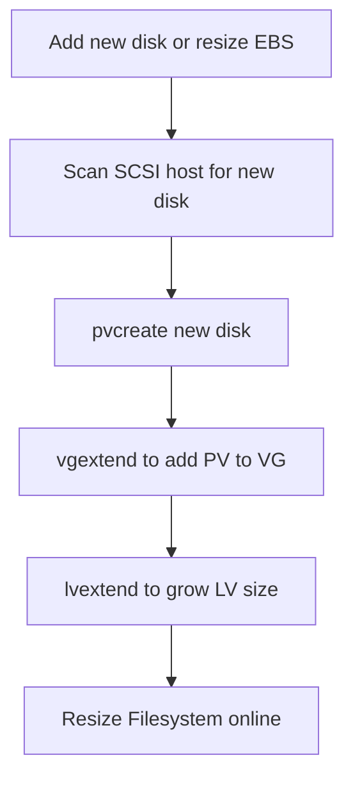

# 🛠️ Day 3: Advanced Linux Tools & Disk Management (LVM)

On Day 3, I leveled up my Linux administration skills by exploring powerful text processing tools (`awk` and `grep`), user management, and advanced storage/disk management using Logical Volume Manager (LVM) on AWS EC2.

---

## 📝 Day 3 Notes (Visual)


---

> [!NOTE]
> **Day 3 Summary (Social Media Caption):**
> Day 3 of my 90 Days of DevOps journey is complete! 
> 
> As I head into the final stretch of my software engineering degree, bridging the gap between writing code and managing infrastructure is a major priority. Today was an incredibly productive deep dive into Linux fundamentals and AWS storage.
> 
> **Here is a look at what I practiced and built today:**
> * **🔍 Text Automation:** Mastered `awk` and `grep` for powerful pattern scanning, text processing, and log filtering.
> * **👥 User & Permission Management:** Got comfortable managing Linux users, groups, and understanding ownership (`chmod`, `chown`).
> * **💽 Disk Management (LVM):** Explored the flexibility of Logical Volume Management by configuring Physical Volumes, Volume Groups, and Logical Volumes.
> * **☁️ AWS EC2 & EBS:** Successfully launched an Amazon Linux 2 instance, attached an EBS volume, mounted the filesystem, and safely cleaned up the resources.

---

## 1. AWK - Pattern Scanning & Processing Language (In-Depth)

`awk` is an interpreted programming language designed for text processing, data extraction, and reporting. It treats files as a collection of records (lines) and fields (columns).

### AWK Special Variables (Interview-Critical)
* **`$0`**: Represents the entire current line.
* **`$1, $2, ... $N`**: Represents the 1st, 2nd, ... N-th field of the line.
* **`NF`**: **Number of Fields** in the current record. Useful for targeting the last column (`$NF`).
* **`NR`**: **Number of Records** (the current line number, 1-indexed).
* **`FS`**: **Field Separator** (input delimiter; defaults to space or tab).
* **`OFS`**: **Output Field Separator** (output delimiter when fields are joined with commas; defaults to space).

### Advanced AWK Interview Scripts
* **Print usernames and shell details from `/etc/passwd` (colon separated):**
  ```bash
  awk -F: '{print "User: " $1 "\t Shell: " $NF}' /etc/passwd
  # Splits by ":" (-F:) and prints column 1 and the last column ($NF)
  ```
* **Filter files larger than 10MB in a list:**
  ```bash
  ls -lh | awk '$5 ~ /[0-9]+M/ && $5 > 10 {print $9, $5}'
  # Matches column 5 (size) containing "M" and checks if value is greater than 10
  ```
* **Calculate the total memory or storage column sum:**
  ```bash
  df -h | awk 'NR>1 {sum += $3} END {print "Total Used: " sum "G"}'
  # Skips header, aggregates column 3 (Used space), and prints the sum at the end
  ```

---

## 2. GREP - Global Regular Expression Print (In-Depth)

`grep` processes text line-by-line and filters lines that match a regular expression pattern.

### Advanced Flags & Context Searching
In production log analysis, you often need to see the context around an error.
* **`-A N` (After):** Print `N` lines of trailing context after matching lines.
* **`-B N` (Before):** Print `N` lines of leading context before matching lines.
* **`-C N` (Context):** Print `N` lines of context before and after matching lines.

### Practical Troubleshooting Scenarios
* **Find error logs with 3 lines of context around it:**
  ```bash
  grep -C 3 "NullPointerException" catalina.out
  ```
* **Exclude comments and empty lines from configuration files (Interview Gold):**
  ```bash
  grep -Ev "^#|^$" /etc/nginx/nginx.conf
  # -E activates Extended Regex. "^#" matches comments. "^$" matches empty lines. -v inverts the match.
  ```
* **Search directories recursively for matching IPs:**
  ```bash
  grep -rnE "[0-9]{1,3}\.[0-9]{1,3}\.[0-9]{1,3}\.[0-9]{1,3}" /var/log/nginx/
  # -r recursive, -n shows line numbers, -E uses regex for IP address matching.
  ```

---

## 3. User & Group Management (Interview-Ready)

Managing system users and groups is fundamental to maintaining permissions and access control inside servers.

### Core User Administration Commands
* **Create a user:**
  ```bash
  sudo useradd -m rayyan
  # -m automatically creates the home directory (/home/rayyan)
  ```
* **Set password for a user:**
  ```bash
  sudo passwd rayyan
  ```
* **Delete a user:**
  ```bash
  sudo userdel -r rayyan
  # -r removes the user's home directory and mail spool
  ```

### Group Administration Commands
* **Create a new group:**
  ```bash
  sudo groupadd devops
  ```
* **Add a user to a group:**
  ```bash
  sudo usermod -aG devops rayyan
  # -aG appends user to supplemental group(s). Always use -a (append) to avoid removing user from other groups.
  ```
* **Verify user identities and group mappings:**
  ```bash
  id rayyan
  # Prints UID, GID, and list of all groups the user belongs to
  ```
  ```bash
  groups rayyan
  ```

### Essential Security Configuration Files
* **`/etc/passwd`:** Contains user details (Username, UID, GID, home directory path, and login shell).
* **`/etc/group`:** Contains group information and membership lists.
* **`/etc/shadow`:** Stores encrypted user passwords and password expiration settings (restricted access for security).

---

## 4. Disk Management using LVM (Logical Volume Manager)

Logical Volume Manager (LVM) provides a high-level abstraction layer over raw physical storage devices. It allows administrators to dynamically resize and manage filesystems without rebooting or unmounting partitions.

### LVM Architecture Flow



### The LVM Objects Explained
1. **Physical Volume (PV):** Represents a raw disk or partition initialized by LVM (e.g. `/dev/xvdb`, `/dev/sdb1`).
2. **Volume Group (VG):** A virtual pool of storage constructed by pooling multiple Physical Volumes. You can add disks to a VG to expand its capacity.
3. **Logical Volume (LV):** A virtual partition created from the VG pool. You format this volume with a filesystem and mount it for applications to use.

---

## 5. A–Z LVM Operations Guide (Lifecycle Commands)

### Phase A: Setup LVM from Scratch
* **Scan for block devices:**
  ```bash
  lsblk
  ```
* **Initialize physical volume (PV):**
  ```bash
  sudo pvcreate /dev/xvdb
  ```
* **Create volume group (VG):**
  ```bash
  sudo vgcreate vgdata /dev/xvdb
  ```
* **Create logical volume (LV):**
  ```bash
  sudo lvcreate -L 5G -n lvdata vgdata
  # -L specifies size (e.g., 5G). -n specifies name. "vgdata" is the source VG.
  ```
* **Create filesystem:**
  ```bash
  sudo mkfs.ext4 /dev/vgdata/lvdata
  ```
* **Mount filesystem:**
  ```bash
  sudo mkdir -p /mnt/data
  sudo mount /dev/vgdata/lvdata /mnt/data
  ```

### Phase B: Utility / Monitoring Commands
* **`pvdisplay` / `pvs`:** Displays details (size, free space, VG mapping) of Physical Volumes.
* **`vgdisplay` / `vgs`:** Displays Volume Group properties (extent size, physical/logical volume count, free extents).
* **`lvdisplay` / `lvs`:** Displays Logical Volume path, status, UUID, and sizes.

### Phase C: Dynamically Extend LVM (No Downtime)
If your mount point `/mnt/data` is running out of space, follow this sequence to expand it live:



1. **Scan for a new physical disk without rebooting the server:**
   ```bash
   echo "- - -" | sudo tee /sys/class/scsi_host/host0/scan
   # Scans SCSI controllers for hot-plugged hard drives
   ```
2. **Initialize new disk `/dev/xvdc` as PV:**
   ```bash
   sudo pvcreate /dev/xvdc
   ```
3. **Extend the existing Volume Group (`vgdata`) with the new PV:**
   ```bash
   sudo vgextend vgdata /dev/xvdc
   ```
4. **Extend the Logical Volume (`lvdata`) by adding 5GB:**
   ```bash
   sudo lvextend -L +5G /dev/vgdata/lvdata
   # Or use -l +100%FREE to consume all remaining unallocated space in VG
   ```
5. **Resize the filesystem to match the new LV boundaries (Crucial step!):**
   * **For Ext4 Filesystem:**
     ```bash
     sudo resize2fs /dev/vgdata/lvdata
     ```
   * **For XFS Filesystem:**
     ```bash
     sudo xfs_growfs /mnt/data
     # Note: xfs_growfs takes the mount point path as its argument
     ```

---

## 6. AWS EC2 & EBS Storage Management (Hands-on)

I practiced attaching and mounting additional volumes dynamically:
1. **Launched Instance:** Started an Amazon Linux 2 EC2 instance.
2. **EBS Volume:** Created a 10GB Elastic Block Store (EBS) volume and attached it as `/dev/xvdb`.
3. **Applied LVM:** Created a PV, VG, and LV using the steps detailed above.
4. **Mounted Storage:** Created a folder at `/mnt/data` and mounted the filesystem.
5. **Cleaned up:** Unmounted the filesystem and cleaned up AWS resources to avoid billing.

---

## 🎓 Interview Questions & Answers

### Q1: What is the difference between standard partitioning (like fdisk) and LVM?
- Standard partitions have fixed sizes. Resizing them requires unmounting, deleting the partition, re-creating it with a larger cylinder count, running checks, and re-mounting (causing downtime).
- LVM abstracts hardware. It allows you to create pool-based storage, extend logical volumes across multiple physical hard drives online (without downtime), and take file system snapshots.

### Q2: How do you verify what filesystem is mounted on a directory?
Use `df -T` or run the `findmnt` command:
```bash
df -T /mnt/data
# Outputs partition type (e.g., ext4, xfs, nfs)
```

### Q3: What is the difference between `resize2fs` and `xfs_growfs`?
- `resize2fs` is used specifically to resize Ext2, Ext3, and Ext4 filesystems. It accepts the block device path.
- `xfs_growfs` is used to expand XFS filesystems. It accepts the active mount directory path, and the filesystem must be mounted to grow it.

---

### 👤 Author / Contact
* **Muhammad Rayyan**
* *Future DevOps Engineer in Progress* 👑
* [GitHub](https://github.com/rayyankhan-devops) | [LinkedIn](https://www.linkedin.com/in/muhammad-rayyan-5645b1317/) | [Email](mailto:rkkhan0750@gmail.com)

---

* [← Day 2: Linux Basics](../day-02-linux-basics/README.md) | [Home](../README.md) | [Day 4: Python & Shell Scripting →](../day-04-python-scripting-permissions/README.md)
