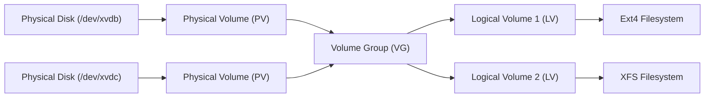

# 🛠️ Day 3: Advanced Linux Tools & Disk Management (LVM)

On Day 3, I leveled up my Linux administration skills by exploring powerful text processing tools (`awk` and `grep`) and advanced storage/disk management using Logical Volume Manager (LVM) on AWS EC2.

---

## 1. AWK - Pattern Scanning & Processing Language

`awk` is an extremely powerful text-processing programming language used for data extraction and reporting. It processes files line by line, split into fields (delimited by spaces/tabs by default).

### Example Dataset (`users.txt`)
| USER | AGE | CITY |
| :--- | :--- | :--- |
| `rayyan` | 22 | Peshawar |
| `alice` | 24 | London |
| `bob` | 23 | Berlin |

### Practical Examples
* **Print specific column:**
  ```bash
  awk '{print $1}' users.txt
  # Outputs only the first column (Usernames)
  ```
* **Print using custom delimiter:**
  ```bash
  awk -F: '{print $1}' /etc/passwd
  # Splits by ":" and prints the system usernames
  ```
* **Filter disk usage information:**
  ```bash
  df -hT | awk 'NR>1 {print $1, $7}'
  # Skips the header row (NR>1) and prints partition name ($1) and mount point ($7)
  ```

---

## 2. GREP - Global Regular Expression Print

`grep` is a command-line utility used to search text or output for lines that match a specific regular expression or pattern.

### Practical Examples
* **Standard search:**
  ```bash
  grep "error" app.log
  # Finds all occurrences of the word "error" inside app.log
  ```
* **Case-insensitive search:**
  ```bash
  grep -i "failed" syslog
  # Finds "failed", "FAILED", "Failed", etc.
  ```
* **Pipelines with grep:**
  ```bash
  ps aux | grep nginx
  # Finds the running nginx process details from system processes
  ```
* **Extended Regular Expressions:**
  ```bash
  grep -E "(ssh|sshd)" /etc/ssh/sshd_config
  # Matches either "ssh" or "sshd" using extended regex (-E)
  ```

---

## 3. Disk Management using LVM (Logical Volume Manager)

LVM provides filesystem flexibility, allowing disk partitions to be resized, added, or removed dynamically without system downtime.

### LVM Architecture Flow



* **Physical Volume (PV):** Actual raw block devices, physical disks, or partitions (e.g. `/dev/xvdb`).
* **Volume Group (VG):** A storage pool created by combining one or more Physical Volumes.
* **Logical Volume (LV):** Virtual partitions carved out from a Volume Group, which can then be formatted with a filesystem.

### LVM Commands Walkthrough

| Step | Command | Description |
| :--- | :--- | :--- |
| **1** | `lsblk` | List all block devices and check storage attachments. |
| **2** | `sudo fdisk -l` | List partition details and disk properties. |
| **3** | `sudo pvcreate /dev/xvdb` | Initialize `/dev/xvdb` as a Physical Volume (PV). |
| **4** | `sudo vgcreate vgdata /dev/xvdb` | Create a Volume Group (VG) named `vgdata` containing `/dev/xvdb`. |
| **5** | `sudo lvcreate -L 5G -n lvdata vgdata` | Carve a 5GB Logical Volume (LV) named `lvdata` out of `vgdata`. |
| **6** | `sudo mkfs.ext4 /dev/vgdata/lvdata` | Format the logical volume with the `ext4` filesystem. |
| **7** | `sudo mount /dev/vgdata/lvdata /mnt/data` | Mount the logical volume to the mount point `/mnt/data`. |
| **8** | `df -h` | Verify the file system is mounted and check available disk space. |

---

## 4. AWS EC2 - Hands-on Storage Management

I practiced attaching and mounting additional volumes dynamically:
1. **Launched Instance:** Started an Amazon Linux 2 EC2 instance.
2. **EBS Volume:** Created a 10GB Elastic Block Store (EBS) volume and attached it as `/dev/xvdb`.
3. **Applied LVM:** Created a PV, VG, and LV using the steps detailed above.
4. **Mounted Storage:** Created a folder at `/mnt/data` and mounted the filesystem.
5. **Cleaned up:** Unmounted the filesystem and cleaned up AWS resources to avoid billing.

---

## 💡 Key Takeaway
> **"Tools are powerful, but practice makes them perfect. Small steps everyday lead to big progress forever!"**

---

### 👤 Author
* **Muhammad Rayyan**
* *Future DevOps Engineer in Progress* 👑

---

* [← Day 2: Linux Basics](../day-02-linux-basics/README.md) | [Home](../README.md)
