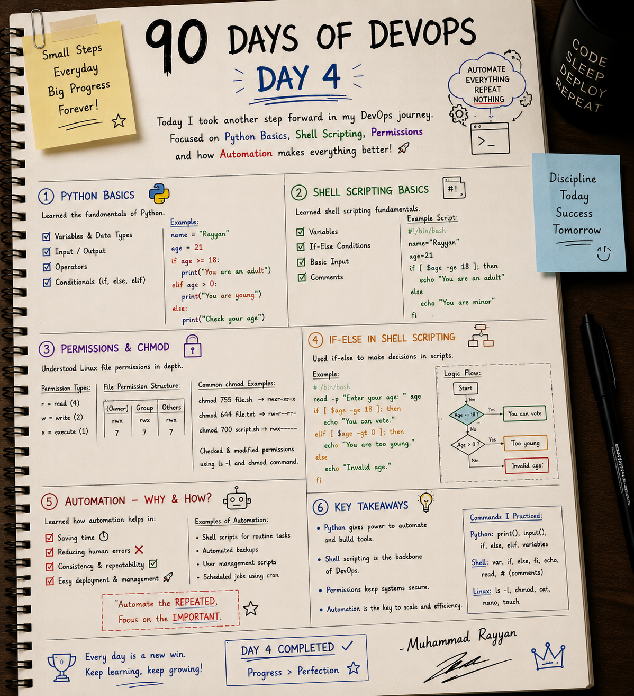

# 🐍 Day 4: Python Scripting, Bash Shell Scripting & Linux Permissions

On Day 4, I took another step forward in my DevOps journey by studying the core scripting tools used to automate system operations: **Python Basics**, **Bash Shell Scripting**, **Unix File Permissions**, and **Cron Automations**.

---

## 📝 Day 4 Notes (Visual)


---

## 1. Python Basics for DevOps

Python is highly readable and comes with massive library support, making it the preferred language for complex cloud automation, writing CLI tools, interacting with cloud APIs (using libraries like `boto3` for AWS), and creating API backends.

### Key Python Concepts
* **Variables & Data Types:** Dynamically typed. Supports integers, floats, strings, lists, dictionaries, tuples, and booleans.
* **Input / Output:** Uses `input()` for reading stdin and `print()` for stdout.
* **Conditionals:** Uses `if`, `elif`, and `else` blocks with indentation defining the scope.

### Python Conditional Script Example
```python
# Save as check_age.py
name = "Rayyan"
age = 21

# Read dynamic input
input_age = input("Enter your age: ")
age = int(input_age)

if age >= 18:
    print(f"Welcome {name}! You are an adult.")
elif age > 0:
    print("You are young.")
else:
    print("Please enter a valid age.")
```

---

## 2. Bash Shell Scripting Basics

Shell scripting is the automated execution of a series of commands in the shell. It is the backbone of Linux administration and OS bootstrap automations.

### Core Scripting Components
* **Shebang (`#!/bin/bash`):** Placed on line 1. Tells the kernel which interpreter to use to parse the script.
* **Variables:** Set variables using `VARNAME="value"` (no spaces around `=`). Reference variables using `$VARNAME`.
* **Comments:** Single-line comments start with `#`.
* **Reading Input:** Use the `read` command (e.g. `read -p "Prompt: " variable`).

### Shell Scripting Conditional Script Example
```bash
#!/bin/bash
# Save as check_age.sh

name="Rayyan"
age=21

# Interactive test
read -p "Enter your age: " age

if [ $age -ge 18 ]; then
    echo "You are an adult"
elif [ $age -gt 0 ]; then
    echo "You are too young"
else
    echo "Invalid age input"
fi
```

### Script Logic Flow Chart

```
           [ Start ]
               |
               v
       [ Prompt for Age ]
               |
               v
      { Is Age >= 18? }
       /             \
    (Yes)            (No)
     /                 \
[ You can vote ]    { Is Age > 0? }
                     /          \
                  (Yes)         (No)
                   /              \
            [ Too young ]    [ Invalid age ]
```

---

## 3. Linux File Permissions & `chmod` (In-Depth)

Linux is a secure, multi-user system. Every file and folder has ownership and permissions to control who can read, write, or execute.

### Permission Categories
Every file has three sets of permissions:
1. **Owner (`u`):** The user who owns the file.
2. **Group (`g`):** The group that has access to the file.
3. **Others (`o`):** Anyone else on the system.

### Permission Bit Values
Permissions are represented by three characters: `r` (read), `w` (write), `x` (execute), or a hyphen `-` (no permission).

| Permission | Character | Octal Value | Description |
| :--- | :---: | :---: | :--- |
| **Read** | `r` | **4** | Allows opening and reading file contents or listing directory files. |
| **Write** | `w` | **2** | Allows modifying file contents or adding/deleting files in a directory. |
| **Execute** | `x` | **1** | Allows running a file as a script or binary, or entering a directory (`cd`). |

```
Permission Structure:
-  r w x  r - x  r - -
^  \___/  \___/  \___/
|    |      |      |
|  Owner  Group  Others
|  (rwx)  (r-x)  (r--)
|   4+2+1  4+0+1  4+0+0
|    = 7    = 5    = 4  => Permission Code: 754
File Type (- = regular file, d = directory)
```

### Common `chmod` Reference Table
* **`chmod 755 file.sh`** (`rwxr-xr-x`): Owner has full access; Group and Others can read/execute but cannot modify. (Standard for executable scripts).
* **`chmod 644 file.txt`** (`rw-r--r--`): Owner can read/write; Group and Others can only read. (Standard for configuration/text files).
* **`chmod 700 script.sh`** (`rwx------`): Only the owner has access. No one else can read, write, or execute. (Great for scripts containing sensitive variables or private keys).

### Managing Ownership Commands
* **Change owner:**
  ```bash
  sudo chown ubuntu script.sh
  ```
* **Change group:**
  ```bash
  sudo chgrp admin script.sh
  ```
* **Change both owner and group simultaneously:**
  ```bash
  sudo chown ubuntu:admin script.sh
  ```

---

## 4. Automation: Why & How?

### Why do we automate?
* **Time Savings:** Eliminates repetitive tasks.
* **Error Reduction:** Avoids typos or missed steps inherent in manual configuration.
* **Consistency:** Ensures environments are identical (Configuration Drift prevention).
* **Deployments:** Faster, reliable releases (zero-downtime, blue-green).

### Automation Examples
1. **Utility Scripting:** Writing scripts to clean logs, backup directories, or audit files.
2. **Scheduling Jobs (Cron):**
   `cron` is a time-based job scheduler daemon in Unix-like systems.
   * **Edit cron jobs:** `crontab -e`
   * **List cron jobs:** `crontab -l`

#### Cron Syntax Formula
```text
*  *  *  *  *  command_to_execute
|  |  |  |  |
|  |  |  |  +----- Day of week (0 - 6) (Sunday=0)
|  |  |  +-------- Month (1 - 12)
|  |  +----------- Day of month (1 - 31)
|  +-------------- Hour (0 - 23)
+----------------- Minute (0 - 59)
```

* **Example Cron Expressions:**
  - Run database backup script every night at 2:00 AM:
    ```text
    0 2 * * * /opt/backup.sh
    ```
  - Clean up tmp files every Sunday at 4:30 PM:
    ```text
    30 16 * * 0 /opt/cleanup.sh
    ```

---

## 🎓 Interview Questions & Answers

### Q1: What is the difference between Python and Bash scripting? When would you choose one over the other?
- **Bash Scripting** is best for system administration, wrapping OS commands, thin wrappers around utility setups, and quick automation tasks under ~100 lines. It has low overhead and executes directly in standard shell environments.
- **Python Scripting** is chosen for complex logic, cross-platform tasks, JSON/YAML API parsing, interacting with cloud providers (AWS, Azure, GCP APIs), and larger modular automation tools. Python has structured error handling (`try-except`) and data structures (lists, dictionaries) which make it cleaner to maintain.

### Q2: A bash script fails to run and displays "Permission Denied". What is the issue and how do you fix it?
By default, newly created text files in Linux do not have execution (`x`) permissions. You must add execution rights.
**Fix:**
```bash
chmod +x script.sh
# or chmod 755 script.sh
./script.sh
```

### Q3: How do you read command-line arguments (positional parameters) in a Bash script?
Use special positional variables:
- `$0` is the script name.
- `$1` is the first argument, `$2` is the second, etc.
- `$#` returns the total number of arguments passed.
- `$?` returns the exit status of the last executed command.
```bash
#!/bin/bash
echo "Script name is: $0"
echo "Hello, $1! Welcome to $2."
```
Usage: `./hello.sh Rayyan DevOps` outputs:
`Hello, Rayyan! Welcome to DevOps.`

---

### 👤 Author / Contact
* **Muhammad Rayyan**
* *Future DevOps Engineer in Progress* 👑
* [GitHub](https://github.com/rayyankhan-devops) | [LinkedIn](https://www.linkedin.com/in/muhammad-rayyan-5645b1317/) | [Email](mailto:rkkhan0750@gmail.com)

---

* [← Day 3: Advanced Linux & LVM](../day-03-linux-advanced-lvm/README.md) | [Home](../README.md)
