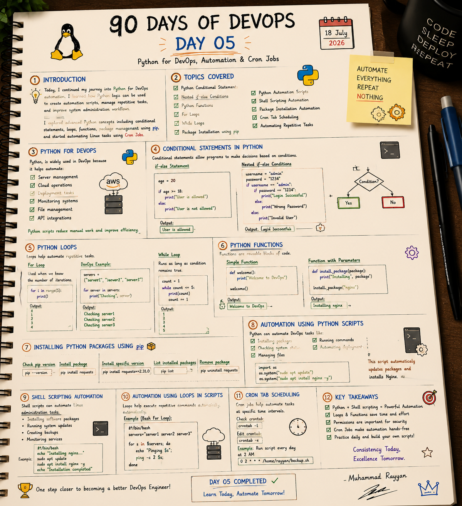

# 🐍 Day 5: Python for DevOps, Automation & Cron Jobs

On Day 5, I continued my journey into Python scripting for DevOps, focusing on how Python logic (conditionals, loops, functions) and library packages can be leveraged to automate systems, manage configuration files, run bash processes, and schedule jobs with Cron.

---

## 📝 Day 5 Notes (Visual)


---

> [!NOTE]
> **Day 5 Summary (Social Media Caption):**
> Day 5 of my 90 Days of DevOps challenge is officially in the books! Today’s focus was all about bridging the gap between coding and operations by leveraging Python for automation and scheduling.
> 
> **Here is a breakdown of what I learned and practiced today:**
> * **🐍 Python for DevOps:** Deepened my understanding of conditional statements (including nested if-else), loops, and functions specifically tailored for server management and cloud operations.
> * **📦 Package Management (pip):** Got comfortable checking, installing, and managing Python dependencies.
> * **🤖 Scripting & Automation:** Combined the power of Python and Shell scripting to automate repetitive tasks, like running system updates and installing software packages programmatically.
> * **⏰ Cron Tab Scheduling:** Learned how to make automation completely hands-free by scheduling scripts to run at specific intervals using crontab (like setting up daily backups at 2 AM!).

---

## 1. Why Python is Crucial in DevOps

While Bash is excellent for single system commands and brief scripts, Python is widely adopted for scaling automations. It reduces manual work across several domains:
* **Server Management:** Parsing system details, processing massive files, and logging results.
* **Cloud Operations:** Interacting with cloud APIs (AWS SDK/`boto3`, Google Cloud SDK) to provision, monitor, and scale resources.
* **Deployment Tasks:** Automating software deployments and rolling back changes on failure.
* **Monitoring Systems:** Querying metrics endpoints, checking health statuses, and triggering alerts.
* **File & Text Management:** Manipulating YAML, JSON, and XML configuration files safely.
* **API Integrations:** Making HTTP requests to third-party endpoints (Jira, Slack, GitHub) using Python's `requests` library.

---

## 2. Conditional Statements in Python

Conditionals enable logic branching based on boolean expressions.

### A. standard `if-else` Statement
```python
age = 20
if age >= 18:
    print("User is allowed")
else:
    print("User is not allowed")
# Output: User is allowed
```

### B. Nested `if-else` Statement (Auth Validation)
```python
username = "admin"
password = "1234"

if username == "admin":
    if password == "1234":
        print("Login Successful")
    else:
        print("Wrong Password")
else:
    print("Invalid User")
# Output: Login Successful
```

---

## 3. Loops in Python & Script Automations

Loops allow you to run blocks of code repeatedly. They are essential for running tasks against multiple servers, databases, or configuration parameters.

### A. `for` Loop
Used when the number of iterations is known beforehand.

* **Basic Range Loop:**
  ```python
  for i in range(5):
      print(i)
  # Output: 0, 1, 2, 3, 4
  ```

* **DevOps Example:**
  ```python
  servers = ["server1", "server2", "server3"]
  for server in servers:
      print("Checking", server)
  
  # Output:
  # Checking server1
  # Checking server2
  # Checking server3
  ```

### B. `while` Loop
Runs continuously as long as a condition evaluates to `True`.

* **Basic While Loop:**
  ```python
  count = 1
  while count <= 5:
      print(count)
      count += 1
  
  # Output: 1, 2, 3, 4, 5
  ```

---

## 4. Reusable Code: Python Functions

Functions represent blocks of code that only run when called. They allow you to write clean, reusable, and testable code.

### A. Simple Function
```python
def welcome():
    print("Welcome to DevOps")

welcome()
# Output: Welcome to DevOps
```

### B. Function with Parameters
```python
def install_package(package):
    print("Installing", package)

install_package("nginx")
# Output: Installing nginx
```

---

## 5. Python Package Management with `pip`

`pip` is the package installer for Python, allowing you to fetch, install, and manage libraries not included in the standard distribution.

| Command | Action / Purpose | Example Usage |
| :--- | :--- | :--- |
| **`pip --version`** | Verify the installed `pip` binary and Python version. | `pip --version` |
| **`pip install <pkg>`**| Installs the latest stable version of a package. | `pip install requests` |
| **`pip install <pkg>==<ver>`** | Installs a specific locked version of a library. | `pip install requests==2.31.0` |
| **`pip list`** | Lists all packages currently installed in the environment. | `pip list` |
| **`pip uninstall <pkg>`** | Deletes an installed package. | `pip uninstall requests` |

---

## 6. Automation Using Scripting (Python vs. Bash)

DevOps engineers must know when to use Python scripts and when to use Shell scripts. Here are parallel automation examples.

### A. Software Installation Automation

* **Python Automation Script (`os.system` method):**
  ```python
  import os
  # Update package registry and install Nginx web server
  os.system("sudo apt update")
  os.system("sudo apt install nginx -y")
  ```

* **Equivalent Shell Script:**
  ```bash
  #!/bin/bash
  echo "Installing nginx..."
  sudo apt update
  sudo apt install nginx -y
  echo "Installation completed"
  ```

### B. Iterative Tasks (Pinging Servers)

* **Automation using Loops in Scripts (Bash For Loop):**
  ```bash
  #!/bin/bash
  servers="server1 server2 server3"
  for s in $servers; do
      echo "Pinging $s";
      ping -c 2 $s;
  done
  ```

---

## 7. Cron Tab Scheduling

Cron is a system service in Unix-like OSes that runs scheduled scripts in the background.

* **List current user cron jobs:**
  ```bash
  crontab -l
  ```
* **Edit user cron jobs:**
  ```bash
  crontab -e
  ```

### Cron Format Cheat Sheet
```text
*  *  *  *  *  command_to_execute
-  -  -  -  -
|  |  |  |  |
|  |  |  |  +----- Day of the week (0 - 6) (Sunday=0)
|  |  |  +-------- Month (1 - 12)
|  |  +----------- Day of the month (1 - 31)
|  +-------------- Hour (0 - 23)
+----------------- Minute (0 - 59)
```

* **Example:** Run script every day at 2 AM:
  ```text
  0 2 * * * /home/rayyan/backup.sh
  ```

---

## 🎓 Interview Questions & Answers

### Q1: What is the difference between `os.system` and `subprocess` in Python for running system commands?
- `os.system()` runs command strings in a subshell. It only returns the exit status of the command (0 for success, non-zero for error), making it impossible to capture and parse output strings inside Python.
- `subprocess.run()` (or `subprocess.Popen`) is more robust and secure. It runs commands directly without invoking a shell (avoiding shell injection vulnerabilities) and allows you to capture standard output (`stdout`) and error output (`stderr`) for verification logic.
  ```python
  import subprocess
  result = subprocess.run(["ls", "-l"], capture_output=True, text=True)
  print(result.stdout)
  ```

### Q2: What is a `requirements.txt` file and how do you use it?
It is a plain text file containing a list of Python dependencies required to run a project, locked to specific versions.
* **Generate from environment:**
  ```bash
  pip freeze > requirements.txt
  ```
* **Install in new environment:**
  ```bash
  pip install -r requirements.txt
  ```

### Q3: Why is it recommended to use Virtual Environments (`venv`) in Python automation?
Using global python dependencies can lead to library conflicts (e.g. Script A needs `requests 2.10` and Script B needs `requests 2.31`). Virtual environments isolate project libraries, keeping global environment scopes clean.
* **Create environment:**
  ```bash
  python3 -m venv myenv
  ```
* **Activate environment:**
  ```bash
  source myenv/bin/activate
  ```

---

### 👤 Author / Contact
* **Muhammad Rayyan**
* *Future DevOps Engineer in Progress* 👑
* [GitHub](https://github.com/rayyankhan-devops) | [LinkedIn](https://www.linkedin.com/in/muhammad-rayyan-5645b1317/) | [Email](mailto:rkkhan0750@gmail.com)

---

* [← Day 4: Python & Scripting](../day-04-python-scripting-permissions/README.md) | [Home](../README.md)
