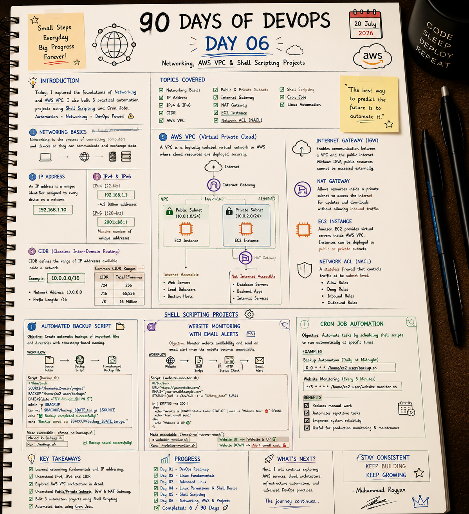

# 🌐 Day 6: Networking, AWS VPC & Shell Scripting Projects

On Day 6, I explored the foundations of computer networking and virtual private clouds inside AWS, and built 3 practical automation projects using Shell Scripting and Cron Jobs.

---

## 📝 Day 6 Notes (Visual)


---

> [!NOTE]
> **Day 6 Summary (Social Media Caption):**
> Day 6 of my 90 Days of DevOps challenge is officially in the books! Today’s focus was all about bridging the gap between coding and operations by leveraging networking and AWS VPC.
> 
> **Here is a breakdown of what I learned and practiced today:**
> * **🌐 Networking Basics:** Deepened my understanding of IP addresses, IPv4 vs. IPv6, and CIDR blocks.
> * **☁️ AWS VPC:** Explored public vs. private subnets, Internet Gateways (IGW), NAT Gateways, EC2 instances, and Network Access Control Lists (NACL).
> * **🐚 Shell Scripting Projects:** Built 3 automation scripts to automate backups, website checks, and system resources.
> * **⏰ Cron Job Automation:** Automated routine tasks hands-free using Crontab scheduler.

---

## 1. Networking Basics & IP Addressing

Networking is the process of connecting computers, servers, and devices to communicate and exchange data.

### A. IP Address (Internet Protocol Address)
A unique identifier assigned to every device connected to a network, allowing devices to locate and communicate with each other.
* Example: `192.168.1.10`

### B. IPv4 vs. IPv6
* **IPv4 (32-bit):**
  - Divided into 4 octets separated by dots (e.g. `192.168.1.1`).
  - Total pool: ~4.3 billion unique addresses.
  - Due to address exhaustion, NAT (Network Address Translation) and CIDR are used.
* **IPv6 (128-bit):**
  - Written in hexadecimal groups separated by colons (e.g. `2001:db8::1`).
  - Total pool: A virtually infinite number of unique addresses ($3.4 \times 10^{38}$).

### C. Private IP Address Ranges (RFC 1918)
Private IP addresses are not routable on the public internet and are used inside local networks (and VPCs):
- **Class A:** `10.0.0.0` to `10.255.255.255` (CIDR: `10.0.0.0/8`)
- **Class B:** `172.16.0.0` to `172.31.255.255` (CIDR: `172.16.0.0/12`)
- **Class C:** `192.168.0.0` to `192.168.255.255` (CIDR: `192.168.0.0/16`)

---

## 2. CIDR (Classless Inter-Domain Routing)

CIDR defines the range of IP addresses available inside a network using an IP address followed by a prefix length.
* Example: `10.0.0.0/16`
  - **Network Address:** `10.0.0.0`
  - **Prefix Length:** `/16` (First 16 bits are locked for the network; remaining 16 bits are available for host assignments)

### Subnet Size Lookup Table

| Prefix Length | Subnet Mask | Available IP Addresses | Usage Context |
| :---: | :--- | :--- | :--- |
| **/24** | `255.255.255.0` | **256** | Small subnets (application clusters). |
| **/16** | `255.255.0.0` | **65,536** | Standard VPC sizes. |
| **/8** | `255.0.0.0` | **16.7 Million** | Large enterprise networks. |

---

## 3. AWS VPC (Virtual Private Cloud) Architecture

AWS VPC allows you to provision a logically isolated virtual network where cloud resources are securely deployed.

```
       +-------------------------------------------------------------+
       |                        AWS VPC                              |
       |  CIDR Block: 10.0.0.0/16                                    |
       |                                                             |
       |     +------------------+           +------------------+     |
       |     |  Public Subnet   |           |  Private Subnet  |     |
       |     |  10.0.1.0/24     |           |  10.0.2.0/24     |     |
       |     |                  |           |                  |     |
       |     |  [EC2 Instance]  |           |  [EC2 Instance]  |     |
       |     |  (Web/Bastion)   |           |  (Database/Apps) |     |
       |     +--------+---------+           +--------+---------+     |
       |              |                              |               |
       |              v                              v               |
       |      [Internet Gateway]               [NAT Gateway]         |
       +--------------+------------------------------+---------------+
                      |                              |
                      +-------------> [Internet] <---+
```

### A. Subnets
* **Public Subnet (Internet Accessible):** Used for resources that must connect directly to the internet (e.g. Web Servers, Load Balancers, Bastion Hosts). Requires a route pointing to the Internet Gateway.
* **Private Subnet (Not Internet Accessible):** Used for backend services (e.g. Database Servers, internal APIs). Outbound internet access goes through a NAT Gateway.

### B. Core VPC Components
* **Internet Gateway (IGW):** Enables two-way communication between the VPC and the public internet. Without an IGW, public resources cannot be accessed externally.
* **NAT Gateway (Network Address Translation):** Allows resources in private subnets to send outbound requests (e.g., download OS updates/dependencies) while blocking unsolicited inbound connections from the internet.
* **Route Tables:** Contain rules (routes) that determine where network traffic is directed.
* **Network ACL (NACL):** A stateless firewall at the subnet level. Filters inbound/outbound traffic using rules with sequential numbers, and can explicitly allow or deny traffic.
* **Security Group:** A stateful firewall at the EC2 instance level. It regulates traffic based on protocol, port, and IP address. (Because it is stateful, allowing inbound traffic automatically allows outbound response traffic).

---

## 4. Shell Scripting Projects (In-Depth)

I built three practical automation shell scripts designed to monitor and manage virtual systems.

### Project 1: Automated Backup Script
* **Objective:** Backup critical directories automatically with timestamped compression archives.
* **Script (`backup.sh`):**
  ```bash
  #!/bin/bash
  # Source directory to back up
  SOURCE="/home/ec2-user/project"
  # Target backup destination
  BACKUP="/home/ec2-user/backups"
  # Timestamp variable
  DATE=$(date +"%Y-%m-%d_%H-%M-%S")

  # Create backup directory if it does not exist
  mkdir -p "$BACKUP"

  # Compress source files
  tar -czf "$BACKUP/backup_$DATE.tar.gz" "$SOURCE"

  echo "Backup completed successfully!"
  echo "Backup saved at: $BACKUP/backup_$DATE.tar.gz"
  ```
* **Execution:**
  ```bash
  chmod +x backup.sh
  ./backup.sh
  ```

---

### Project 2: Website Monitoring with Email Alerts
* **Objective:** Send email notifications to administrators if a monitored website returns a non-200 HTTP code.
* **Script (`website-monitor.sh`):**
  ```bash
  #!/bin/bash
  URL="https://yourwebsite.com"
  EMAIL="your-email@example.com"

  # Fetch the HTTP status code
  STATUS=$(curl -o /dev/null -s -w "%{http_code}" "$URL")

  if [ "$STATUS" -ne 200 ]; then
      echo "Website is DOWN! Status Code: $STATUS" | mail -s "Website Alert 🚨" "$EMAIL"
      echo "Website DOWN! Alert email sent."
  else
      echo "Website is UP"
  fi
  ```
* **Execution:**
  ```bash
  chmod +x website-monitor.sh
  ./website-monitor.sh
  ```

---

### Project 3: Disk Space & System Metric Alerts
* **Objective:** Monitor storage usage on the partition and alert when filesystem usage exceeds the threshold.
* **Script (`disk-monitor.sh`):**
  ```bash
  #!/bin/bash
  THRESHOLD=85
  EMAIL="your-email@example.com"

  # Check disk space percentage on root mount
  USAGE=$(df -h / | awk 'NR==2 {print $5}' | tr -d '%')

  if [ "$USAGE" -gt "$THRESHOLD" ]; then
      echo "WARNING: Disk space usage is high at ${USAGE}%!" | mail -s "Disk Space Alert ⚠️" "$EMAIL"
      echo "Warning trigger met. Alert sent."
  else
      echo "Disk space usage is safe at ${USAGE}%."
  fi
  ```
* **Execution:**
  ```bash
  chmod +x disk-monitor.sh
  ./disk-monitor.sh
  ```

---

## 5. Cron Job Automation

Cron is a system service in Linux that automates shell script execution.

### Crontab Scheduling Configurations
* Edit your tasks: `crontab -e`
* List your tasks: `crontab -l`

### Examples
* **Daily Backup (Run backup script at midnight daily):**
  ```text
  0 0 * * * /home/ec2-user/backup.sh
  ```
* **Website Check (Run status check every 5 minutes):**
  ```text
  */5 * * * * /home/ec2-user/website-monitor.sh
  ```
---

## 🛠️ Executable Practice Scripts

I have created actual, runnable production-grade automation scripts inside this folder to practice system backups and server checks:

### A. System Backup Script
* **Backup Tool:** [backup.sh](backup.sh) (uses strict exit flags, creates compressed tarballs, cleans logs, and removes archives older than 7 days)
* **To run the script:**
  ```bash
  chmod +x backup.sh
  ./backup.sh [source_directory] [backup_directory]
  ```

### B. Network & Service Monitoring
* **Website Auditor:** [website_monitor.sh](website_monitor.sh) (resolves HTTP response codes using curl, with logging options)
* **Disk Space Monitor:** [disk_monitor.sh](disk_monitor.sh) (checks storage capacity and flags high utilization)
* **To run the scripts:**
  ```bash
  chmod +x website_monitor.sh disk_monitor.sh
  ./website_monitor.sh [url] [email]
  ./disk_monitor.sh [threshold_percent] [email]
  ```

---

## 🎛️ A–Z Networking Troubleshooting Command Guide (Interview Prep)

DevOps interviews frequently feature scenarios where you must diagnose network issues on a server. Here is an index of commands you must know.

### A. Network Interface Diagnostics
* **`ip addr` / `ip a`:** Displays all network interfaces, status, MAC addresses, and assigned IP addresses (replaces deprecated `ifconfig`).
* **`ip route`:** Displays the active kernel routing table, showing default gateways and route paths.

### B. DNS Queries & Resolution
* **`nslookup <domain>`:** Simple DNS check querying nameserver resolution.
* **`dig <domain> [ANY/A/MX/TXT]`:** Domain Information Groper. Returns detailed DNS record details, authority sections, TTLs, and query times.
  - Example: `dig google.com`
  - query specific nameserver: `dig @8.8.8.8 google.com`

### C. Socket Status & Listening Ports
* **`ss -tulpn`:** Displays active TCP/UDP ports, listening sockets, socket states, and corresponding PID details (replaces deprecated `netstat`).
  - Flags: `-t` (tcp), `-u` (udp), `-l` (listening), `-p` (show process details), `-n` (numeric ports/IPs).

### D. Port Connectivity Testing
* **`nc -zv <host> <port>`:** Netcat. Checks if a TCP/UDP port is open on a target remote IP address.
  - Example: `nc -zv 10.0.2.14 5432` (Tests PostgreSQL connection in private subnet).
* **`telnet <host> <port>`:** Alternative port connectivity test command.

### E. Trace Routes & Latency
* **`ping -c 4 <host>`:** Sends ICMP Echo Requests to verify if a remote host is reachable and measures latency.
* **`traceroute <host>`:** Traces the path packets take to reach a destination host, displaying the IP addresses of intermediate routers (hops).

---

## 🎓 Interview Questions & Answers

### Q1: What is the difference between a Security Group and a Network ACL (NACL) in AWS?
- **Security Groups** operate at the **instance level** (EC2). They are **stateful** (allowing inbound traffic automatically allows outbound response traffic). Rules only support "allow" statements.
- **NACLs** operate at the **subnet level**. They are **stateless** (outbound response traffic must be explicitly allowed by an outbound rule). Rules are processed in numerical order and support both "allow" and "deny" statements.

### Q2: A private EC2 instance needs internet access to download software updates, but must not be accessible from the public internet. How do you design this?
1. Deploy the EC2 instance inside a **Private Subnet**.
2. Deploy a **NAT Gateway** in a **Public Subnet** of the same VPC.
3. Configure the Private Subnet's **Route Table** to forward internet-bound traffic (`0.0.0.0/0`) to the NAT Gateway.
4. Ensure the Public Subnet's Route Table contains a route forwarding traffic (`0.0.0.0/0`) to the **Internet Gateway (IGW)**.

### Q3: You run a service on port 8080 but cannot access it from outside the server. How do you troubleshoot this?
1. **Host Check:** Run `ss -tulpn | grep 8080` to verify if the process is running and listening on all interfaces (`0.0.0.0:8080`) or just local loopback (`127.0.0.1:8080`).
2. **Local Firewall:** Check local host firewall rules (`sudo ufw status` or `sudo iptables -L`).
3. **Cloud Firewall:** Check AWS Security Group rules to confirm port 8080 is open to your external IP.
4. **Intermediate Firewalls:** Verify subnet NACL rules.

---

### 👤 Author / Contact
* **Muhammad Rayyan**
* *Future DevOps Engineer in Progress* 👑
* [GitHub](https://github.com/rayyankhan-devops) | [LinkedIn](https://www.linkedin.com/in/muhammad-rayyan-5645b1317/) | [Email](mailto:rkkhan0750@gmail.com)

---

* [← Day 5: Python & Automation](../day-05-python-devops-automation/README.md) | [Home](../README.md)
