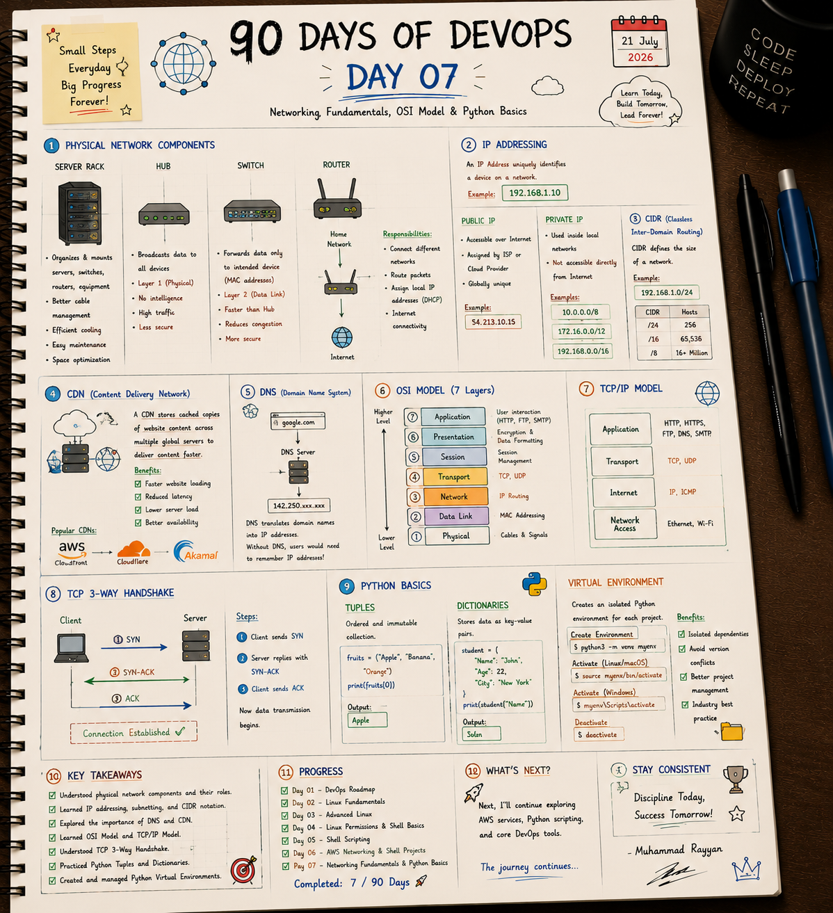

# 🌐 Day 7: Networking Fundamentals, OSI Model & Python Basics

On Day 7, I bridged the gap between physical networking components, key data-routing models (OSI and TCP/IP), connection handshakes (TCP 3-way), and Python development workspaces (Tuples, Dictionaries, and Virtual Environments).

---

## 📝 Day 7 Notes (Visual)


---

> [!NOTE]
> **Day 7 Summary (Social Media Caption):**
> Day 7 of my 90 Days of DevOps challenge is complete! Today's session was all about mastering the plumbing of the internet and securing my Python workspace.
> 
> **Here's a quick breakdown of what I tackled today:**
> * **🔌 Physical Components:** Explored how Server Racks, Hubs, Switches (Layer 2 MAC), and Routers (Layer 3 IP routing) power connectivity.
> * **🌐 Core Networking:** Deepened my understanding of IP Addressing (Public vs. Private) and CIDR calculations.
> * **🚀 DNS & CDN:** Explored how DNS translates domains to IPs and how CDNs (CloudFront/Cloudflare) use caching to slash latency.
> * **📦 Protocol Models:** Mastered the 7 Layers of the OSI Model, the 4-layer TCP/IP framework, and the TCP 3-Way Handshake.
> * **🐍 Python Basics & venv:** Practiced tuples, dictionaries, and created isolated Virtual Environments.

---

## 1. Physical Network Components

Modern server architectures rely on hardware operating at different levels of intelligence.

* **Server Rack:** A physical chassis structure that houses, secures, and organizes hardware (servers, switches, patch panels). It optimizes cooling airflow, cable management, and floor space.
* **Hub (Layer 1 - Physical):** A basic device with no intelligence. When it receives data packets on a port, it broadcasts (floods) them to all connected ports, causing congestion and security risks.
* **Switch (Layer 2 - Data Link):** An intelligent device that inspects packet headers to lookup MAC Addresses and forwards frames only to the intended destination device.
* **Router (Layer 3 - Network):** An intelligent gateway that connects entirely different networks, routes packets using IP Routing Tables, and assigns local IP addresses dynamically (via DHCP).

---

## 2. IP Addressing & CIDR Networks

An IP address uniquely identifies a device on a network (IPv4: 32-bit, IPv6: 128-bit).

* **Public IP:** Globally unique address routable on the public internet, assigned by an ISP or Cloud Provider (e.g., `54.213.10.15`).
* **Private IP:** Used internally inside local networks or AWS VPCs, not accessible directly from the public internet.
* **CIDR (Classless Inter-Domain Routing):** Defines the size and IP allocation bounds of a network by specifying a prefix length (e.g., `192.168.1.0/24`).

### CIDR Host Allocation Lookup Table
| Prefix Length | Netmask | Available Host Addresses | Common Usage |
| :---: | :--- | :--- | :--- |
| **/24** | `255.255.255.0` | **254** (256 - 2 reserved) | Subnet level cloud instances. |
| **/16** | `255.255.0.0` | **65,534** | Standard VPC network space. |
| **/8** | `255.0.0.0` | **16.7 Million** | Internal private Class A address pool. |

---

## 3. DNS (Domain Name System) & CDN (Content Delivery Network)

* **DNS:** The phonebook of the internet. It resolves user-friendly domain names (e.g., `google.com`) into computer-readable IP addresses (e.g., `142.250.190.46`). Without DNS, users would need to manually enter IP addresses.
* **CDN:** A network of globally distributed proxy servers that cache static assets (HTML, images, CSS, video) close to users' physical locations.
  - **Benefits:** Minimizes latency, reduces source server load, speeds page loading, and increases service availability.
  - **Popular Tools:** AWS CloudFront, Cloudflare, Akamai.

---

## 4. Network Protocol Models

Network protocols are categorized into conceptual layers to define how data transitions from hardware signals up to applications.

### OSI 7-Layer Model vs. TCP/IP 4-Layer Model

| Layer | OSI Layer Name | TCP/IP Layer Name | Protocol Data Unit (PDU) | Protocols / Examples |
| :---: | :--- | :--- | :--- | :--- |
| **7** | **Application** | . | Data | HTTP, HTTPS, SSH, DNS, SMTP |
| **6** | **Presentation** | **Application** | Data | TLS, SSL, JPEG, ASCII |
| **5** | **Session** | . | Data | NetBIOS, RPC |
| **4** | **Transport** | **Transport** | Segment (TCP) / Datagram (UDP) | TCP, UDP |
| **3** | **Network** | **Internet** | Packet | IP, ICMP, IPSec |
| **2** | **Data Link** | . | Frame | Ethernet, MAC addresses, PPP |
| **1** | **Physical** | **Network Access** | Bits | Cables, Fiber, Wi-Fi |

---

## 5. TCP 3-Way Handshake Connection Process

TCP (Transmission Control Protocol) is connection-oriented. Before exchanging data, client and server must perform a 3-way synchronization handshake to agree on sequence numbers.

```
Client                                                  Server
  |                                                       |
  | ----------- 1. SYN (Synchronize) -------------------> |  [Server: LISTEN -> SYN-RCVD]
  |             - Flags: [SYN=1]                          |
  |             - Seq: client_sequence (X)                |
  |                                                       |
  | <---------- 2. SYN-ACK (Sync-Acknowledge) ----------- |  [Client: SYN-SENT -> ESTABLISHED]
  |             - Flags: [SYN=1, ACK=1]                   |
  |             - Seq: server_sequence (Y)                |
  |             - Ack: X + 1                              |
  |                                                       |
  | ----------- 3. ACK (Acknowledge) -------------------> |  [Server: ESTABLISHED]
  |             - Flags: [ACK=1]                          |
  |             - Seq: X + 1                              |
  |             - Ack: Y + 1                              |
  |                                                       |
  v                                                       v
                 CONNECTION ESTABLISHED (Data can flow)
```

1. **SYN:** Client sends a synchronization packet containing a random initial sequence number `X`.
2. **SYN-ACK:** Server acknowledges receipt of the client's sequence by sending `Ack = X + 1`, and sends its own sequence number `Y`.
3. **ACK:** Client acknowledges the server's sequence by sending `Ack = Y + 1`. The connection is now established on both sides.

---

## 6. Python Basics: Data Structures

* **Tuples:** Ordered, indexable, and **immutable** collections. Defined using parentheses `()`.
  ```python
  fruits = ("Apple", "Banana", "Orange")
  print(fruits[0])  # Output: Apple
  # fruits[0] = "Grapes" -> Throws TypeError (cannot modify tuple)
  ```
* **Dictionaries:** Unordered key-value stores. Defined using curly braces `{}`. Keys must be unique and immutable (strings, numbers, tuples).
  ```python
  student = {
      "Name": "John",
      "Age": 22,
      "City": "New York"
  }
  print(student["Name"])  # Output: John
  ```

---

## 7. Python Virtual Environments (`venv`)

A virtual environment is a self-contained directory tree that contains its own Python installation, pip installer, and libraries, keeping dependencies isolated on a per-project basis.

* **Benefits:** Prevents version conflicts between scripts, avoids polluting the global system environment, and allows testing dependencies in isolation.

### Core CLI Management Commands
* **Create Environment:**
  ```bash
  python3 -m venv myenv
  ```
* **Activate (Linux/macOS):**
  ```bash
  source myenv/bin/activate
  ```
* **Activate (Windows PowerShell):**
  ```powershell
  .\myenv\Scripts\Activate.ps1
  ```
* **Deactivate Environment:**
  ```bash
  deactivate
  ```

---

## 🛠️ Executable Practice Scripts

I have created actual, runnable code templates inside this folder to practice networking concepts and Python data structures:

* **Virtual Env Bootstrap Script:** [venv_demo.sh](venv_demo.sh) (automates environment creation, activation, package checks, and cleanup)
* **Python Data Structures script:** [tuples_dicts.py](tuples_dicts.py) (implements tuple immutability handling and dictionary safe access methods)
* **TCP Handshake Simulator:** [tcp_handshake_sim.py](tcp_handshake_sim.py) (visualizes synchronization states and sequence number handshakes)

To run the scripts:
```bash
chmod +x venv_demo.sh tcp_handshake_sim.py tuples_dicts.py
./venv_demo.sh
python3 tuples_dicts.py
python3 tcp_handshake_sim.py
```

---

## 🎓 Interview Questions & Answers

### Q1: What is the difference between a Hub and a Switch?
- A **Hub** is a Layer 1 physical device. It has no intelligence or MAC tables and floods received data packets to all ports, which increases network collisions and poses security risks.
- A **Switch** is a Layer 2 data link device. It reads MAC address headers and forwards frames only to the specific port connected to the destination device, reducing collisions and improving network security.

### Q2: What is the difference between a TCP and a UDP packet?
- **TCP (Transmission Control Protocol):** Connection-oriented. Requires a 3-way handshake before transmitting data. It guarantees delivery, maintains sequence ordering, performs error-checking, and handles flow control, but introduces network latency (used for HTTP, SSH, database connections).
- **UDP (User Datagram Protocol):** Connectionless. Packets (datagrams) are sent without checking receiver status. It does not guarantee packet delivery or ordering, but has minimal overhead and is extremely fast (used for video streaming, DNS lookups, VoIP).

### Q3: Why are Python tuples faster than lists?
Python stores lists in dynamic memory pools with over-allocation headroom to support appending/insertion operations. Because tuples are immutable, Python allocates the exact memory size needed, making tuple lookups faster and more memory-efficient.

---

### 👤 Author / Contact
* **Muhammad Rayyan**
* *Future DevOps Engineer in Progress* 👑
* [GitHub](https://github.com/rayyankhan-devops) | [LinkedIn](https://www.linkedin.com/in/muhammad-rayyan-5645b1317/) | [Email](mailto:rkkhan0750@gmail.com)

---

* [← Day 6: Networking & VPC](../day-06-networking-vpc-scripting/README.md) | [Home](../README.md)
