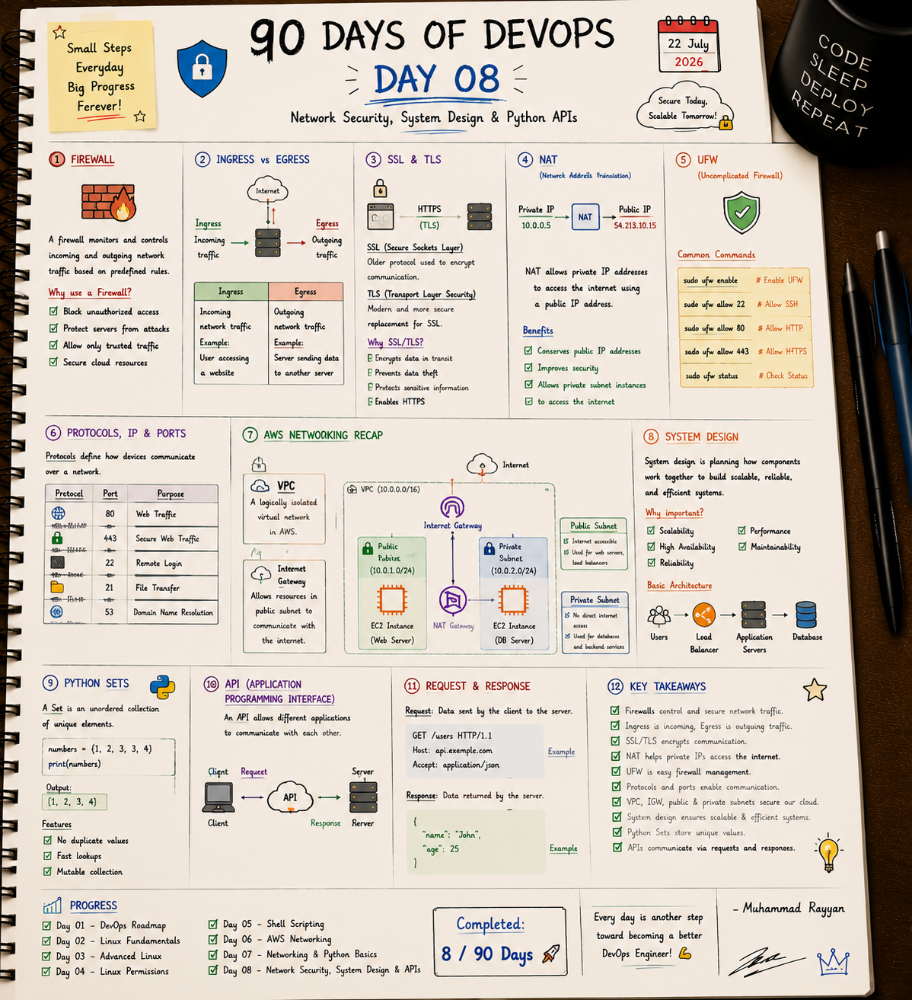

# 🛡️ Day 8: Network Security, System Design & Python APIs

On Day 8, I advanced into network security boundaries (UFW, Firewalls, Ingress vs. Egress), transport-level encryption (SSL/TLS, NAT), enterprise scaling patterns (System Design, Load Balancing), and Python API development (Sets, HTTP Request-Response lifecycle).

---

## 📝 Day 8 Notes (Visual)


---

> [!NOTE]
> **Day 8 Summary (Social Media Caption):**
> Day 8 of my 90 Days of DevOps challenge is complete! Today's session was all about building secure, scalable, and API-driven systems.
> 
> **Here's a quick breakdown of what I learned and practiced today:**
> * **🛡️ Firewall & UFW:** Learned to configure rule definitions (Ingress/Egress) and manage Linux firewalls securely.
> * **🔐 Encrypted Connections:** Mastered SSL/TLS encryption principles and NAT (Network Address Translation) gateways.
> * **📈 System Design:** Explored core scalability architectures including Load Balancers (Round Robin), application nodes, and databases.
> * **🐍 Python Sets & APIs:** Developed zero-dependency HTTP server handlers in Python and practiced mutable sets.

---

## 1. Firewall & Security Rules (UFW)

A firewall monitors and controls incoming and outgoing network traffic based on predefined security rules.
* **Why use it?** Blocks unauthorized access, prevents brute-force intrusions, establishes trusted zone routing, and locks down cloud instances.
* **Ingress (Incoming Traffic):** Traffic coming from the internet or other servers into your server (e.g. users loading a webpage on port 80).
* **Egress (Outgoing Traffic):** Traffic initiated by your server going out to other hosts (e.g. server sending logs to a monitoring service or pulling software packages).

### Common UFW (Uncomplicated Firewall) Command Reference

| Command | Action / Description | Example Usage |
| :--- | :--- | :--- |
| **`sudo ufw status`** | Checks current firewall state and active rules. | `sudo ufw status verbose` |
| **`sudo ufw enable`** | Activates the firewall rule engine (Warning: allow SSH first). | `sudo ufw enable` |
| **`sudo ufw disable`** | Deactivates the firewall rule engine. | `sudo ufw disable` |
| **`sudo ufw allow <port>`**| Allows incoming traffic on a specific port. | `sudo ufw allow 22/tcp` |
| **`sudo ufw deny <port>`** | Denies / Blocks traffic on a port. | `sudo ufw deny 8080/tcp` |
| **`sudo ufw reset`** | Cleans up and resets all rules back to default factory settings. | `sudo ufw reset` |

---

## 2. SSL/TLS & NAT Routing

* **SSL & TLS:** SSL (Secure Sockets Layer) is the deprecated predecessor of TLS (Transport Layer Security). TLS encrypts data in transit to prevent interception, session hijacking, or eavesdropping (HTTPS).
* **NAT (Network Address Translation):** A method that maps local private IP addresses to a single public IP to communicate outbound to the internet.
  - **Benefits:** Conserves the public IPv4 address space, hides private servers behind a gateway (securing them), and enables software updates from private subnets.

### Common Network Ports Reference
* **Port 80 (HTTP):** Standard web server traffic (unencrypted).
* **Port 443 (HTTPS):** Secure web server traffic (encrypted via SSL/TLS).
* **Port 22 (SSH):** Secure remote shell login.
* **Port 21 (FTP):** File transfer protocol.
* **Port 53 (DNS):** Domain Name System lookup query queries.

---

## 3. System Design: Scalability & Architecture

System Design is planning how system components (servers, databases, caches, load balancers) work together to satisfy performance requirements.

```
                  [ Clients / Users ]
                           |
                           v
                  [ Load Balancer ]
                 /        |        \
                v         v         v
             [App-01]  [App-02]  [App-03] (App Servers)
                \         |         /
                 v        v        v
                   [ Database ]
```

### Core Architecture Components
1. **Load Balancer:** Receives all client requests and distributes them across multiple Application Servers to prevent overloading.
   - **Common Algorithms:** Round Robin (sequential routing), Least Connections (routes to the least busy server), and IP Hash (routes users based on IP hash).
2. **App Servers (Application Nodes):** Multiple redundant instances executing the application code.
3. **Database (DB):** Mapped storage for persistent data records (SQL or NoSQL).

### Core Non-Functional Requirements (NFRs)
* **Scalability:** The ability of a system to handle increased load (Horizontal: adding more servers; Vertical: adding CPU/RAM to a single server).
* **Reliability:** The probability that a system performs its required functions under stated conditions for a specified period.
* **High Availability (HA):** Designing systems to remain operational with minimal downtime (redundancy, failover).
* **Maintainability:** The ease with which a system can be modified, updated, or corrected.

---

## 4. Python Sets & REST APIs

* **Python Sets:** Unordered collections of unique elements. Defined using curly braces `{}` or the `set()` function.
  - Sets do not allow duplicate entries.
  - Support set math: Union (`|`), Intersection (`&`), and Difference (`-`).
  - Lookup times are $O(1)$ constant time (highly performant compared to lists).
  ```python
  numbers = {1, 2, 3, 3, 4}
  print(numbers)  # Output: {1, 2, 3, 4} (duplicates automatically removed)
  ```

* **APIs (Application Programming Interfaces):** Allows two systems to interact via HTTP requests and responses.

### HTTP Request Example
```text
GET /users HTTP/1.1
Host: api.example.com
Accept: application/json
```
- **Method (GET):** The action to perform.
- **Path (/users):** The targeted resource path.
- **Headers:** Configuration metadata.

### HTTP Response Example
```json
{
  "name": "John",
  "age": 25
}
```

---

## 🛠️ Executable Practice Scripts

I have created actual, runnable code templates inside this folder to practice firewall rules, sets, and API serving:

* **UFW Firewall Manager:** [ufw_manager.sh](ufw_manager.sh) (safely allows SSH, HTTP, HTTPS, denies custom ports, and resets rules with root guard checks)
* **Python Sets & API Simulator:** [sets_api_demo.py](sets_api_demo.py) (implements set math operations and simulates JSON request-response formatting)
* **Standard JSON API Server:** [api_server.py](api_server.py) (zero-dependency REST API server listening on http://127.0.0.1:8000 returning JSON payloads)

To run the scripts:
```bash
chmod +x ufw_manager.sh sets_api_demo.py api_server.py
sudo ./ufw_manager.sh
python3 sets_api_demo.py
python3 api_server.py
```

---

## 🎓 Interview Questions & Answers

### Q1: What is the difference between Stateful and Stateless firewalls?
- **Stateful Firewalls (e.g. AWS Security Groups):** Track active connection states. If an inbound connection is allowed, the firewall automatically permits matching outbound response traffic without requiring a separate rule.
- **Stateless Firewalls (e.g. AWS Subnet NACLs):** Do not keep track of connection state. Every single inbound and outbound packet must be explicitly evaluated and permitted by rules on both sides.

### Q2: What is the difference between Horizontal Scaling and Vertical Scaling?
- **Horizontal Scaling (Scale Out):** Adding more instances/nodes to your resource pool (e.g. adding 3 more EC2 servers behind a load balancer). It is highly available and resilient (if one fails, others handle traffic).
- **Vertical Scaling (Scale Up):** Adding more power (CPU, RAM, Disk) to an existing server. It has a physical limit, requires downtime to upgrade, and represents a single point of failure.

### Q3: When should you use a Python Set instead of a Python List?
Use a **Set** when:
1. You need to ensure all stored items are completely unique (automatic deduplication).
2. You need to perform mathematical set operations (intersections, unions, differences).
3. You need high-performance membership checks (`if item in set`), which run in $O(1)$ constant time using hash tables, compared to $O(N)$ linear scans in lists.

---

### 👤 Author / Contact
* **Muhammad Rayyan**
* *Future DevOps Engineer in Progress* 👑
* [GitHub](https://github.com/rayyankhan-devops) | [LinkedIn](https://www.linkedin.com/in/muhammad-rayyan-5645b1317/) | [Email](mailto:rkkhan0750@gmail.com)

---

* [← Day 7: Networking & Python Basics](../day-07-networking-python-basics/README.md) | [Home](../README.md)
