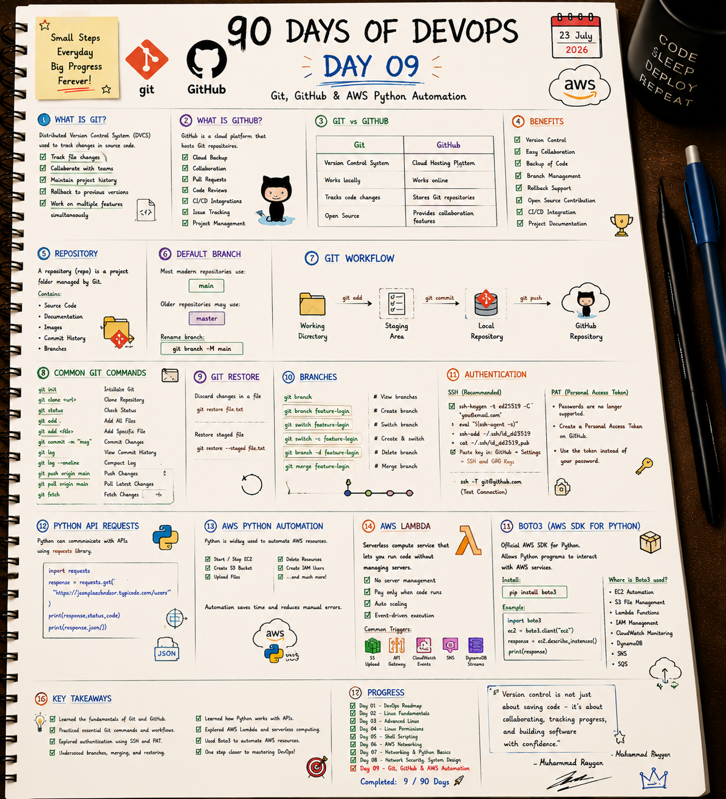

# 🐙 Day 9: Git, GitHub & AWS Python Automation

On Day 9, I explored decentralized version control workflows (Git architecture, branches, restore states), secure remote authorization methods (SSH Keygen, PAT tokens), and Python-driven cloud resource automation (API Clients, Boto3 AWS SDK, and AWS Lambda serverless compute functions).

---

## 📝 Day 9 Notes (Visual)


---

> [!NOTE]
> **Day 9 Summary (Social Media Caption):**
> Day 9 of my 90 Days of DevOps challenge is complete! Today's session was all about code collaboration and cloud automation.
> 
> **Here's a quick breakdown of what I mastered today:**
> * **🐙 Git & GitHub Workflow:** Explored Git states (Working Directory -> Staging Area -> Local Repo -> Remote) and basic commands.
> * **🌱 Branching & Merging:** Got comfortable creating, switching, merging, and deleting feature branches.
> * **🔐 Authentication:** Configured secure SSH keys (ed25519) and Personal Access Tokens (PAT) for GitHub.
> * **🤖 AWS Python Automation (Boto3):** Explored Boto3 to manage EC2 instances and S3 storage resources.
> * **⚡ Serverless Compute:** Studied AWS Lambda function characteristics and event triggers.

---

## 1. Git vs. GitHub Foundations

* **Git:** A free, open-source **Distributed Version Control System (DVCS)** that runs locally on your machine to track code modifications, preserve history, and support branching.
* **GitHub:** A cloud-based hosting platform that stores Git repositories, enabling team collaboration, pull requests, code reviews, and automated CI/CD pipelines.

### The Three Git States & Workflow
```
[ Working Directory ] -----> ( git add ) -----> [ Staging Area ]
        ^                                               |
        |                                               v
  (git restore)                                  ( git commit )
        |                                               |
        +-----------------------------------------------+
                                                        |
                                                        v
                                                [ Local Repository ] -----> ( git push ) -----> [ GitHub Remote ]
```

1. **Working Directory:** The local folder where you modify files.
2. **Staging Area (Index):** A draft directory tracking modifications ready to be committed.
3. **Local Repository:** The `.git` database storing committed snapshots.
4. **Remote Repository:** The hosted platform (GitHub) containing shared code.

---

## 2. A-Z Git Command Cheat Sheet (Interview Prep)

### A. Core Operations
* **`git init`:** Initializes an empty Git repository in the current folder (creates `.git`).
* **`git clone <url>`:** Downloads a remote repository and its history locally.
* **`git status`:** Displays file modifications (untracked, modified, or staged states).
* **`git add <file>`:** Adds modifications to the staging index. Use `git add .` to stage all files.
* **`git commit -m "message"`:** Commits staged files, creating a permanent snapshot in history.
* **`git log`:** Lists commit history. Use `git log --oneline` for a compact view.
* **`git push origin <branch>`:** Uploads local branch commits to the remote repository.
* **`git pull origin <branch>`:** Fetches remote changes and merges them into the local branch.
* **`git fetch`:** Fetches remote metadata changes *without* merging them locally.

### B. Branch Management
* **`git branch`:** Lists local branches. (Current branch is highlighted).
* **`git branch <name>`:** Creates a new branch at the current commit.
* **`git switch <name>`:** Switches to the specified branch.
* **`git switch -c <name>`:** Creates and switches to a new branch in a single command (replaces `git checkout -b`).
* **`git merge <name>`:** Merges the specified branch's commits into the active branch.
* **`git branch -d <name>`:** Deletes the specified branch (safety guard: refuses if unmerged).
* **`git branch -M main`:** Renames the default branch to `main`.

### C. Git Restore & Discard States
* **Discard unstaged modifications (Working Directory check):**
  ```bash
  git restore file.txt
  ```
* **Unstage a file (moves it from Staging back to Working Directory):**
  ```bash
  git restore --staged file.txt
  ```

---

## 3. Git Secure Authentication

### A. SSH Key Authentication (Recommended)
SSH keys use asymmetric cryptography to authenticate your local machine without prompting for credentials.
1. **Generate an Ed25519 SSH Keypair:**
   ```bash
   ssh-keygen -t ed25519 -C "you@email.com"
   ```
2. **Start the SSH agent daemon:**
   ```bash
   eval "$(ssh-agent -s)"
   ```
3. **Add the private key to the agent:**
   ```bash
   ssh-add ~/.ssh/id_ed25519
   ```
4. **Copy the public key to add to GitHub Settings:**
   ```bash
   cat ~/.ssh/id_ed25519.pub
   ```
5. **Verify connection:**
   ```bash
   ssh -T git@github.com
   ```

### B. Personal Access Tokens (PAT)
GitHub deprecated password authentication for HTTPS Git operations. You must generate a PAT under Developer Settings and use it as your password when prompting.

---

## 4. Python API requests

DevOps automations often query external API interfaces. Python uses the `requests` library to make HTTP calls:
```python
import requests
response = requests.get("https://jsonplaceholder.typicode.com/users")
print(response.status_code)  # e.g., 200
print(response.json())       # Parses returned JSON response body
```

---

## 5. AWS Python Automation & Boto3

**Boto3** is the official Amazon Web Services (AWS) SDK for Python, allowing you to write scripts to provision, manage, and delete cloud resources.

* **Client API (Low-level):** Map 1-to-1 with service APIs. Returns standard JSON dictionaries.
  ```python
  import boto3
  ec2 = boto3.client("ec2")
  response = ec2.describe_instances()
  ```
* **Resource API (High-level):** Object-oriented abstraction layer representing resources (deprecated in newer versions, but useful to know).

---

## 6. AWS Lambda (Serverless Compute)

AWS Lambda is a serverless, event-driven compute service that executes code without requiring you to provision or manage servers.
* **Core Characteristics:** Ephemeral (runs for a max of 15 minutes), stateless, auto-scaling, and pay-per-use (billed based on request count and execution duration).
* **Common Event Triggers:** S3 uploads, API Gateway requests, CloudWatch Cron rules, and DynamoDB streams.

---

## 🛠️ Executable Practice Scripts

I have created actual, runnable code templates inside this folder to practice Git states, API calls, and Boto3 AWS automation:

* **Git Sandbox Simulator:** [git_practice_helper.sh](git_practice_helper.sh) (runs an interactive Git workflow showing staging, commits, branches, and restores)
* **REST API Client:** [api_client_requests.py](api_client_requests.py) (uses `requests` to fetch mock user profiles, checks status codes, and parses JSON output)
* **Boto3 AWS Simulator:** [aws_boto3_mock.py](aws_boto3_mock.py) (simulates listing S3 buckets and starting EC2 instances, with fallback checks)

To run the scripts:
```bash
chmod +x git_practice_helper.sh api_client_requests.py aws_boto3_mock.py
./git_practice_helper.sh
python3 api_client_requests.py
python3 aws_boto3_mock.py
```

---

## 🎓 Interview Questions & Answers

### Q1: What is the difference between `git fetch` and `git pull`?
- **`git fetch`** downloads commits, files, and refs from a remote repository into your local `.git` directory, but does not modify your working directory. It is safe and does not overwrite local work.
- **`git pull`** is a combination of two commands: `git fetch` followed immediately by `git merge`. It downloads remote changes and merges them into your active local branch, which can trigger merge conflicts.

### Q2: What is a git merge conflict and how do you resolve it?
A merge conflict occurs when two branches modify the exact same line of a file, or one branch deletes a file that the other branch modifies, and you attempt to merge them.
* **Resolution Steps:**
  1. Git pauses the merge and marks the conflict blocks with markers (`<<<<<<<`, `=======`, `>>>>>>>`).
  2. Open the conflicting files and manually choose which changes to keep.
  3. Save the file, stage it (`git add <file>`), and commit the resolution (`git commit`).

### Q3: What are the benefits of Serverless computing (e.g. AWS Lambda) over traditional server VMs (e.g. EC2)?
- **No Server Management:** No need to patch OS versions, configure system firewalls, or manage scaling limits.
- **Cost Efficiency:** You are billed only when the code executes, whereas VMs charge hourly rates even when idle.
- **Auto-Scaling:** Lambda scales out automatically from 1 to thousands of concurrent requests without manual configuration.

---

### 👤 Author / Contact
* **Muhammad Rayyan**
* *Future DevOps Engineer in Progress* 👑
* [GitHub](https://github.com/rayyankhan-devops) | [LinkedIn](https://www.linkedin.com/in/muhammad-rayyan-5645b1317/) | [Email](mailto:rkkhan0750@gmail.com)

---

* [← Day 8: Security & APIs](../day-08-network-security-apis/README.md) | [Home](../README.md)
