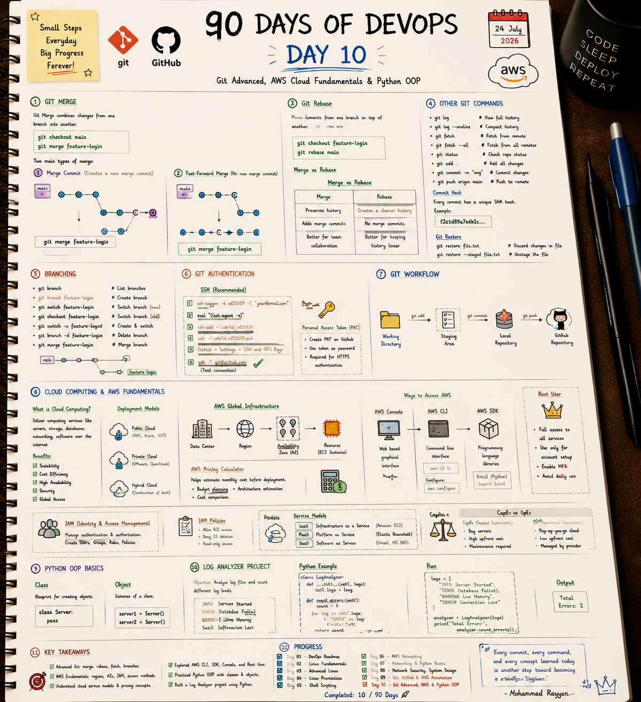

# ☁️ Day 10: Git Advanced, AWS Cloud Fundamentals & Python OOP

Welcome to Day 10 of the **DevOps 90 Days Challenge**! Today's focus is on mastering advanced Git techniques, understanding core AWS cloud computing concepts, and building object-oriented Python log analyzers.

---

## 📝 Day 10 Visual Notes


---

> [!NOTE]
> **Day 10 Summary:**
> * **🔀 Git Merge vs Rebase:** Learned when to keep commit history branching vs making history a clean straight line.
> * **☁️ AWS Cloud Models:** Explored Public/Private/Hybrid clouds, Regions, Availability Zones, and CapEx vs OpEx.
> * **🔐 IAM Basics:** Understood root user safety, IAM users, groups, roles, and policies.
> * **🐍 Python OOP:** Created a reusable `LogAnalyzer` class to process server logs.

---

## 1. Advanced Git: Merge vs. Rebase

### Quick Rule of Thumb:
* **Use `git merge`** when combining team features into public branches (`main`). It preserves full history.
* **Use `git rebase`** when updating your personal feature branch with the latest `main` changes before opening a Pull Request. It creates a clean linear history.

```bash
# Example: Rebase your feature branch onto main
git checkout feature-branch
git rebase main
```

---

## 2. AWS Cloud Fundamentals

* **IaaS (Infrastructure as a Service):** You manage OS and apps; AWS manages hardware (e.g., Amazon EC2).
* **PaaS (Platform as a Service):** AWS manages OS and runtime; you only provide code (e.g., AWS Elastic Beanstalk).
* **SaaS (Software as a Service):** Fully managed web software (e.g., Gmail, MS 365).

### CapEx vs. OpEx
* **CapEx (Capital Expenditure):** Buying physical servers upfront. High initial cost.
* **OpEx (Operational Expenditure):** Pay-as-you-go cloud billing. Pay only for what you run.

---

## 3. Files in This Folder

- 📄 [aws_iam_policy.json](aws_iam_policy.json): Sample JSON policy granting S3 and EC2 permissions.
- 🐍 [log_analyzer_oop.py](log_analyzer_oop.py): Python OOP script parsing server log metrics.

### Run the Python Log Analyzer:
```bash
python3 log_analyzer_oop.py
```

---

### 👤 Author / Contact
* **Muhammad Rayyan** | [GitHub](https://github.com/rayyankhan-devops) | [LinkedIn](https://www.linkedin.com/in/muhammad-rayyan-5645b1317/)

---

* [← Day 9: Git & AWS Automation](../day-09-git-aws-automation/README.md) | [Home](../README.md)
