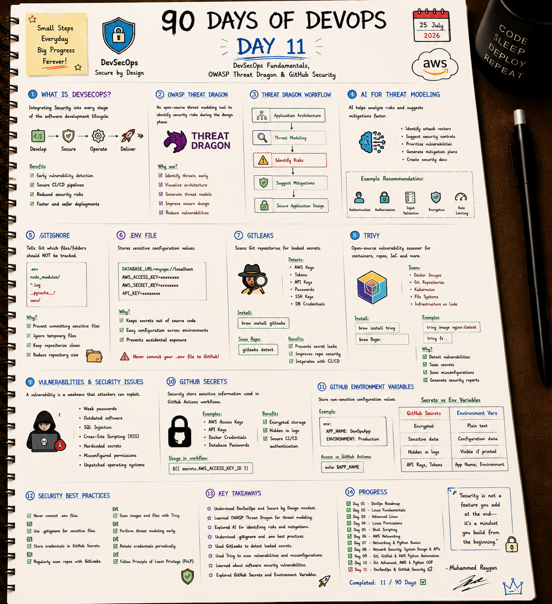

# 🛡️ Day 11: DevSecOps Fundamentals, OWASP Threat Dragon & GitHub Security

Welcome to Day 11! Today's goal is **Shift-Left Security**—finding security risks early in development before code reaches production.

---

## 📝 Day 11 Visual Notes


---

> [!NOTE]
> **Day 11 Summary:**
> * **🛡️ What is DevSecOps?** Security integrated into every phase: Develop -> Secure -> Operate -> Deliver.
> * **🔍 Gitleaks:** Tool that scans your Git commits to catch leaked passwords and AWS API keys.
> * **📦 Trivy:** Vulnerability scanner for filesystems, libraries, and Docker container images.
> * **🔐 GitHub Secrets:** Storing passwords safely in CI/CD without leaking them in plain text.

---

## 1. Secrets Security & `.gitignore`

Never commit passwords or API keys! Always use `.env` files for local development and keep `.env` inside `.gitignore`.

```bash
# Example .gitignore entry
.env
node_modules/
*.log
```

---

## 2. GitHub Secrets vs. Environment Variables

* **GitHub Secrets:** Used for sensitive tokens (AWS keys, DB passwords). Masked in logs (`***`).
* **Environment Variables:** Used for non-sensitive values (Port number, `APP_ENV=production`).

---

## 3. Files in This Folder

- 📜 [security_scanner.sh](security_scanner.sh): Shell script that runs Gitleaks and Trivy checks.
- ⚙️ [gitleaks.toml](gitleaks.toml): Custom Gitleaks security scan rule config.
- 📄 [.env.example](.env.example): Template showing how to format local environment variables.

### Run the Security Scanner:
```bash
chmod +x security_scanner.sh
./security_scanner.sh
```

---

### 👤 Author / Contact
* **Muhammad Rayyan** | [GitHub](https://github.com/rayyankhan-devops) | [LinkedIn](https://www.linkedin.com/in/muhammad-rayyan-5645b1317/)

---

* [← Day 10: Git & AWS OOP](../day-10-git-aws-python-oop/README.md) | [Home](../README.md)
