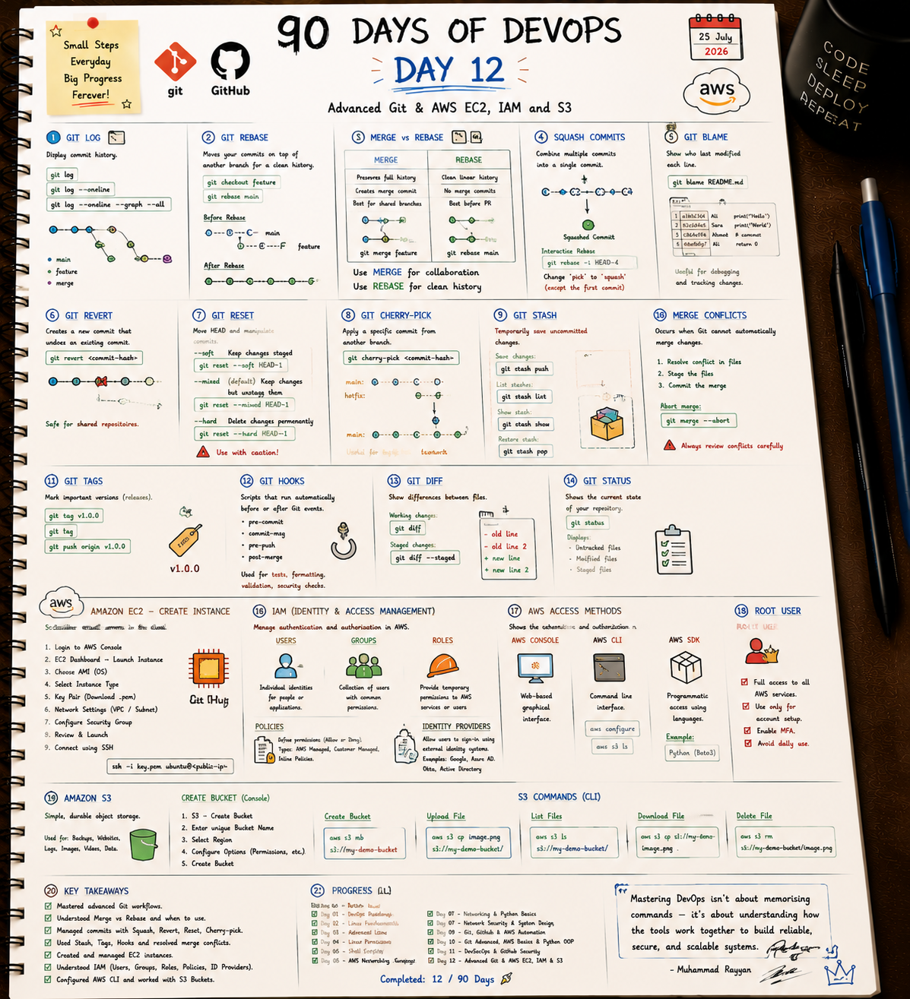

# ⚡ Day 12: Advanced Git & AWS EC2, IAM and S3

Welcome to Day 12! Today's focus is on mastering powerful Git troubleshooting commands and launching AWS core services (EC2, IAM roles, S3 buckets).

---

## 📝 Day 12 Visual Notes


---

> [!NOTE]
> **Day 12 Summary:**
> * **🔀 Git Reset Commands:** `--soft` (keeps staged changes), `--mixed` (unstages changes), `--hard` (deletes changes).
> * **📍 Useful Git Tools:** `git stash` (save work temporarily), `git blame` (see who edited a line), `git cherry-pick` (grab one specific commit).
> * **☁️ AWS EC2 & IAM:** Launched Linux EC2 instances via SSH, managed IAM user roles and permissions.
> * **📦 Amazon S3:** Practiced S3 file uploads and bucket management using AWS CLI.

---

## 1. Useful AWS S3 CLI Commands

```bash
# Create a new bucket
aws s3 mb s3://my-unique-devops-bucket

# Upload a file to S3
aws s3 cp index.html s3://my-unique-devops-bucket/

# List files in bucket
aws s3 ls s3://my-unique-devops-bucket/
```

---

## 2. Files in This Folder

- 🐍 [ec2_s3_manager.py](ec2_s3_manager.py): Python script auditing EC2 instances and S3 buckets.
- 📄 [s3_bucket_policy.json](s3_bucket_policy.json): Example public read S3 bucket policy.
- 📜 [git_hooks_setup.sh](git_hooks_setup.sh): Script that installs a pre-commit hook to block secret files.

### Run the Scripts:
```bash
chmod +x git_hooks_setup.sh ec2_s3_manager.py
./git_hooks_setup.sh
python3 ec2_s3_manager.py
```

---

### 👤 Author / Contact
* **Muhammad Rayyan** | [GitHub](https://github.com/rayyankhan-devops) | [LinkedIn](https://www.linkedin.com/in/muhammad-rayyan-5645b1317/)

---

* [← Day 11: DevSecOps Security](../day-11-devsecops-github-security/README.md) | [Home](../README.md)
