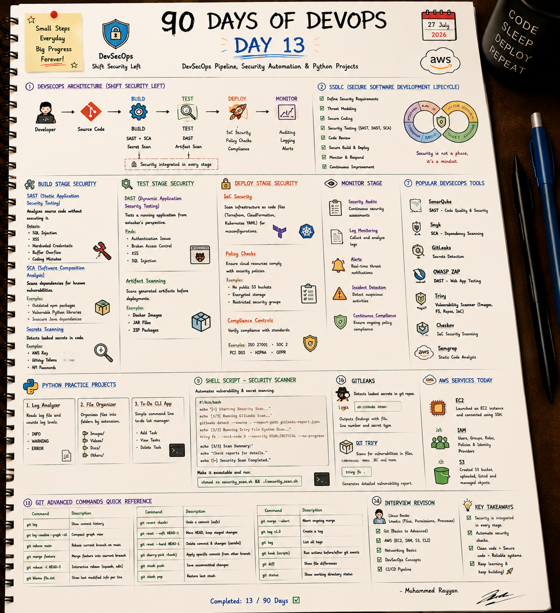

# 🔒 Day 13: DevSecOps Pipeline, Security Automation & Python Projects

On Day 13, I focused on DevSecOps pipeline stage gates (SAST, DAST, SCA, Container scanning), Secure SDLC frameworks, compliance standards (SOC 2, ISO 27001), and built utility automation scripts in Python.

---

## 📝 Day 13 Notes (Visual)


---

> [!NOTE]
> **Day 13 Summary (Social Media Caption):**
> Day 13 of my 90 Days of DevOps challenge is complete! Security automation in CI/CD is what turns fragile deployments into resilient enterprise software.
> 
> **Key Focus Areas:**
> * **🔄 Shift-Left Architecture:** Integrated SAST, SCA, and secret scanning into build/test stages.
> * **🛠️ Popular DevSecOps Tools:** SonarQube, Snyk, GitLeaks, OWASP ZAP, Trivy, Checkov, and Semgrep.
> * **🐍 Python Projects:** Implemented log analyzers and directory file organizer scripts.

---

## 1. DevSecOps Testing Categories

* **SAST (Static Application Security Testing):** Scans source code without executing it (e.g. SonarQube, Semgrep).
* **SCA (Software Composition Analysis):** Scans dependencies for known open-source CVE vulnerabilities (e.g. Snyk, Trivy).
* **DAST (Dynamic Application Security Testing):** Tests running applications from an outside-in attacker perspective (e.g. OWASP ZAP).
* **IaC Security:** Scans Terraform, CloudFormation, and Kubernetes manifests for misconfigurations (e.g. Checkov, Trivy).

---

## 🛠️ Executable Practice Scripts

* **Pipeline Security Runner:** [pipeline_security_runner.sh](pipeline_security_runner.sh)
* **Python File Organizer:** [file_organizer.py](file_organizer.py)

```bash
chmod +x pipeline_security_runner.sh file_organizer.py
./pipeline_security_runner.sh
python3 file_organizer.py
```

---

### 👤 Author / Contact
* **Muhammad Rayyan** | [GitHub](https://github.com/rayyankhan-devops) | [LinkedIn](https://www.linkedin.com/in/muhammad-rayyan-5645b1317/)

---

* [← Day 12: Git & AWS EC2](../day-12-git-aws-ec2-iam-s3/README.md) | [Home](../README.md)
