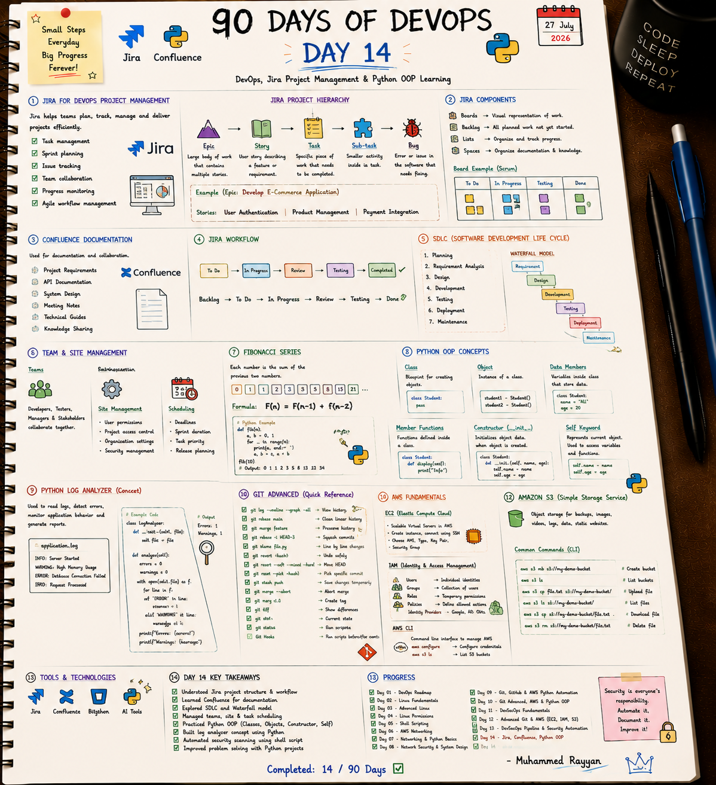

# 📋 Day 14: DevOps, Jira Project Management & Python OOP Learning

On Day 14, I explored Agile software development methodologies, Jira project management hierarchies (Epics, Stories, Tasks, Bugs), Confluence documentation standards, SDLC models, and Python OOP constructor initialization.

---

## 📝 Day 14 Notes (Visual)


---

> [!NOTE]
> **Day 14 Summary (Social Media Caption):**
> Day 14 of my 90 Days of DevOps challenge is complete! DevOps is as much about process management and collaboration as it is about writing code.
> 
> **Key Concepts Covered:**
> * **📋 Jira Hierarchy:** Epic -> Story -> Task -> Sub-task -> Bug.
> * **🔄 Agile Scrum Workflows:** Managing backlogs, sprint planning, estimation (Fibonacci), and boards.
> * **📚 Confluence:** Maintaining project requirements, API documentation, and runbooks.
> * **🐍 Python OOP:** Constructor methods (`__init__`) and class instance attributes.

---

## 1. Jira Work Item Hierarchy

```
[ Epic: Develop E-Commerce Platform ]
       |
       +---> [ Story: User Authentication ]
       |            |
       |            +---> [ Task: Implement JWT Middleware ]
       |            +---> [ Sub-task: Write unit tests for auth ]
       |
       +---> [ Bug: Database Connection Leak on Logout ]
```

---

## 🛠️ Executable Practice Script

* **Jira Agile Simulator:** [jira_simulator.py](jira_simulator.py)

```bash
chmod +x jira_simulator.py
python3 jira_simulator.py
```

---

### 👤 Author / Contact
* **Muhammad Rayyan** | [GitHub](https://github.com/rayyankhan-devops) | [LinkedIn](https://www.linkedin.com/in/muhammad-rayyan-5645b1317/)

---

* [← Day 13: DevSecOps Pipeline](../day-13-devsecops-pipeline-python-projects/README.md) | [Home](../README.md)
