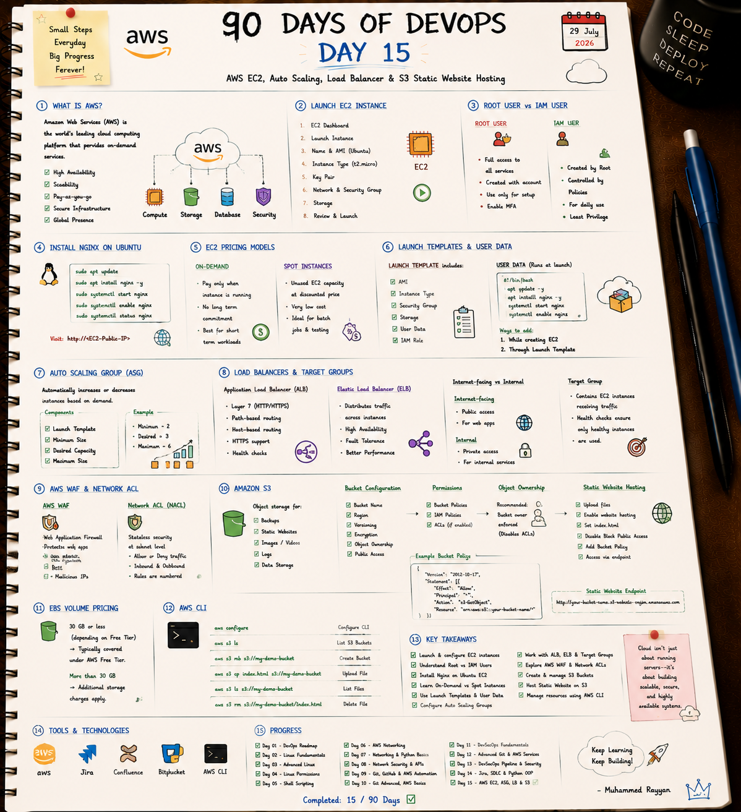

# 🌐 Day 15: AWS EC2, Auto Scaling, Load Balancer & S3 Static Website Hosting

On Day 15, I deepened my cloud infrastructure knowledge by automating web server bootstrap via EC2 User Data, configuring Auto Scaling Groups (ASG), setting up Application Load Balancers (ALB Layer 7), analyzing AWS WAF vs NACLs, and hosting static websites on Amazon S3.

---

## 📝 Day 15 Notes (Visual)


---

> [!NOTE]
> **Day 15 Summary (Social Media Caption):**
> Day 15 of my 90 Days of DevOps challenge is complete! Cloud infrastructure isn't just about running single virtual machines—it's about building self-healing, highly available, and auto-scaling systems.
> 
> **Key Focus Areas:**
> * **⚡ Launch Templates & User Data:** Automated Nginx installation on launch.
> * **📈 Auto Scaling Group (ASG):** Configured Min (2), Desired (3), and Max (6) capacities.
> * **⚖️ Load Balancer (ALB):** Distributed incoming HTTP/HTTPS traffic to healthy target groups.
> * **🌐 S3 Static Website:** Configured bucket policies, public read access, and static hosting endpoints.

---

## 1. AWS Auto Scaling Group (ASG) Components

* **Launch Template:** Defines AMI ID, instance type (`t2.micro`), key pair, security groups, IAM role, and User Data script.
* **Minimum Size:** The lowest number of healthy EC2 instances ASG will keep running (e.g. `2`).
* **Desired Capacity:** The baseline target number of active instances (e.g. `3`).
* **Maximum Size:** The upper scaling threshold during high traffic spikes (e.g. `6`).

---

## 2. AWS WAF vs. Network ACL (NACL)

| Security Shield | OSI Layer | Type | Focus Area |
| :--- | :--- | :--- | :--- |
| **AWS WAF** | **Layer 7** (Application) | Stateful | Blocks SQL Injection, Cross-Site Scripting (XSS), rate-limiting malicious IPs. |
| **Network ACL** | **Layer 3/4** (Network/Subnet) | Stateless | Subnet-level inbound/outbound firewall rules evaluated by rule number. |

---

## 🛠️ Executable Practice Scripts

* **EC2 User Data Nginx Script:** [userdata_nginx.sh](userdata_nginx.sh)
* **S3 Website Deployment Script:** [s3_static_website_deploy.sh](s3_static_website_deploy.sh)

```bash
chmod +x userdata_nginx.sh s3_static_website_deploy.sh
./userdata_nginx.sh
./s3_static_website_deploy.sh
```

---

### 👤 Author / Contact
* **Muhammad Rayyan** | [GitHub](https://github.com/rayyankhan-devops) | [LinkedIn](https://www.linkedin.com/in/muhammad-rayyan-5645b1317/)

---

* [← Day 14: Jira & SDLC](../day-14-jira-sdlc-python-oop/README.md) | [Home](../README.md)
