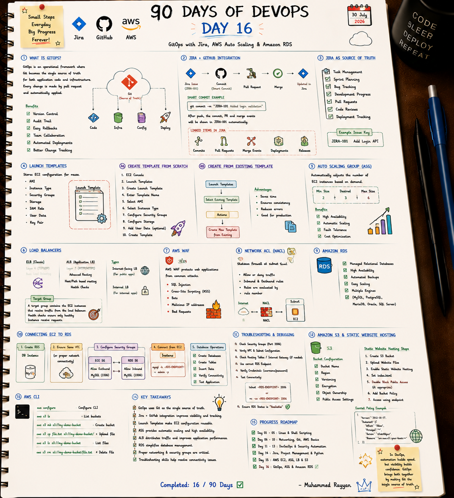

# 🗄️ Day 16: GitOps with Jira, AWS Auto Scaling & Amazon RDS

On Day 16, I explored the GitOps framework (Git as single source of truth), Jira + GitHub smart commit integrations, Amazon RDS managed databases, EC2 to RDS network security groups, and troubleshooting DB connectivity.

---

## 📝 Day 16 Notes (Visual)


---

> [!NOTE]
> **Day 16 Summary (Social Media Caption):**
> Day 16 of my 90 Days of DevOps challenge is complete! GitOps connects code repositories directly to production runtime states, ensuring auditability and fast rollbacks.
> 
> **Key Focus Areas:**
> * **🐙 GitOps Framework:** Git becomes the single source of truth for app & infra changes.
> * **🔗 Jira + GitHub:** Smart commits link PRs directly to Jira issues (`git commit -m "JIRA-101 Added login validation"`).
> * **🗄️ Amazon RDS:** Provisioned managed MySQL/PostgreSQL instances and established EC2 Security Group rules.

---

## 1. Connecting EC2 Instances to Amazon RDS

```
[ EC2 Web Instance ] -- (Security Group: EC2-SG)
        |
        | Outbound: Allow TCP 3306 to RDS-SG
        v
[ RDS MySQL Database ] -- (Security Group: RDS-SG)
          Inbound: Allow TCP 3306 ONLY from EC2-SG ID
```

---

## 🛠️ Executable Practice Script

* **RDS Connection Tester:** [rds_connection_tester.sh](rds_connection_tester.sh)

```bash
chmod +x rds_connection_tester.sh
./rds_connection_tester.sh
```

---

### 👤 Author / Contact
* **Muhammad Rayyan** | [GitHub](https://github.com/rayyankhan-devops) | [LinkedIn](https://www.linkedin.com/in/muhammad-rayyan-5645b1317/)

---

* [← Day 15: AWS EC2 & S3](../day-15-aws-ec2-asg-alb-s3/README.md) | [Home](../README.md)
