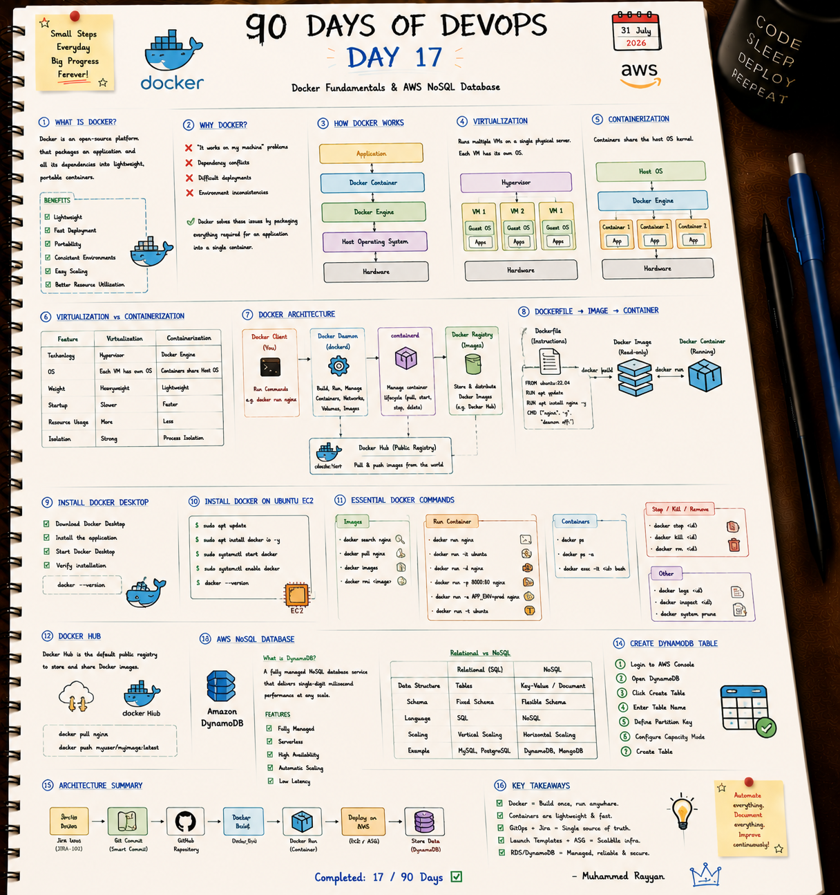

# 🐳 Day 17: Docker Fundamentals & AWS NoSQL Database

On Day 17, I started my deep dive into containerization with Docker, comparing Virtual Machines (Hypervisors) vs. Containers (Shared Kernel), mastering Docker Architecture, CLI operations, and exploring Amazon DynamoDB NoSQL databases.

---

## 📝 Day 17 Notes (Visual)


---

> [!NOTE]
> **Day 17 Summary (Social Media Caption):**
> Day 17 of my 90 Days of DevOps challenge is complete! Containerization revolutionized how we package and run modern applications across development and production environments.
> 
> **Key Focus Areas:**
> * **🐳 Virtualization vs. Containerization:** Hypervisor VMs vs Shared Host OS Kernel containers.
> * **⚙️ Docker Architecture:** Docker Client, Daemon (`dockerd`), `containerd`, and Registries.
> * **📦 Docker CLI:** Mastered `run`, `ps`, `exec`, `logs`, `stop`, `rm`, and `system prune`.
> * **⚡ Amazon DynamoDB:** Managed NoSQL key-value database scaling.

---

## 1. Virtualization vs. Containerization

| Feature | Virtualization (VMs) | Containerization (Docker) |
| :--- | :--- | :--- |
| **Technology** | Hypervisor (Type 1 / Type 2). | Docker Engine. |
| **OS Model** | Each VM runs its own full Guest OS. | Containers share the host OS kernel. |
| **Startup Time** | Minutes. | Seconds / Milliseconds. |
| **Weight & Sizing** | Gigabytes (Heavyweight). | Megabytes (Lightweight). |

---

## 2. Essential Docker CLI Commands

```bash
# Search & Pull Image
docker pull nginx:alpine

# Run Container in Detached Mode on Port 8080
docker run -d --name my-web -p 8080:80 nginx:alpine

# Execute Interactive Shell Inside Container
docker exec -it my-web sh

# View Container Logs
docker logs -f my-web

# Cleanup Stopped Containers & Unused Images
docker system prune -a
```

---

## 🛠️ Executable Practice Script

* **Docker Container Auditor:** [docker_container_auditor.sh](docker_container_auditor.sh)

```bash
chmod +x docker_container_auditor.sh
./docker_container_auditor.sh
```

---

### 👤 Author / Contact
* **Muhammad Rayyan** | [GitHub](https://github.com/rayyankhan-devops) | [LinkedIn](https://www.linkedin.com/in/muhammad-rayyan-5645b1317/)

---

* [← Day 16: GitOps & Amazon RDS](../day-16-gitops-jira-asg-rds/README.md) | [Home](../README.md)
