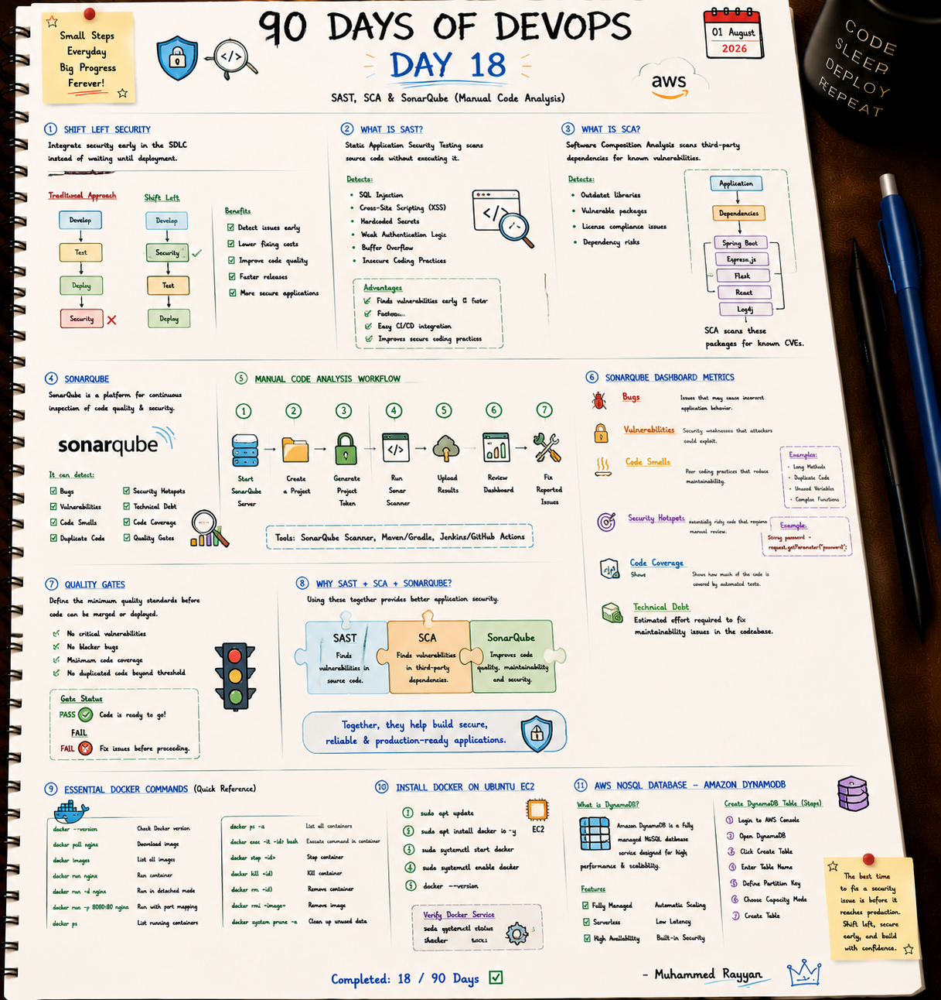

# 🔍 Day 18: SAST, SCA & SonarQube (Manual Code Analysis)

On Day 18, I focused on automated code quality and security inspection using SonarQube, evaluating SAST vs. SCA scans, analyzing Quality Gates, and tracking technical debt metrics.

---

## 📝 Day 18 Notes (Visual)


---

> [!NOTE]
> **Day 18 Summary (Social Media Caption):**
> Day 18 of my 90 Days of DevOps challenge is complete! Code that compiles isn't necessarily secure or maintainable—SonarQube gives us full visibility into bugs, security hotspots, and technical debt.
> 
> **Key Topics:**
> * **🔍 SAST vs. SCA:** Static source code analysis vs open-source third-party vulnerability scanning.
> * **📊 SonarQube Metrics:** Bugs, Vulnerabilities, Code Smells, Security Hotspots, Coverage, Technical Debt.
> * **🚦 Quality Gates:** Enforcing mandatory Pass/Fail build thresholds before code deployment.

---

## 1. SonarQube Dashboard Metrics

* **Bugs:** Coding errors that cause incorrect runtime behavior.
* **Vulnerabilities:** Security weaknesses susceptible to exploitation (e.g. SQL Injection).
* **Code Smells:** Maintainability issues that make code confusing or difficult to refactor.
* **Security Hotspots:** Security-sensitive code sections that require human review.
* **Technical Debt:** Estimated effort (time) required to fix all code maintainability issues.

---

## 🛠️ Executable Practice Script

* **SonarQube Scanner Runner:** [sonarqube_scanner_runner.sh](sonarqube_scanner_runner.sh)

```bash
chmod +x sonarqube_scanner_runner.sh
./sonarqube_scanner_runner.sh
```

---

### 👤 Author / Contact
* **Muhammad Rayyan** | [GitHub](https://github.com/rayyankhan-devops) | [LinkedIn](https://www.linkedin.com/in/muhammad-rayyan-5645b1317/)

---

* [← Day 17: Docker Basics](../day-17-docker-basics-dynamodb/README.md) | [Home](../README.md)
