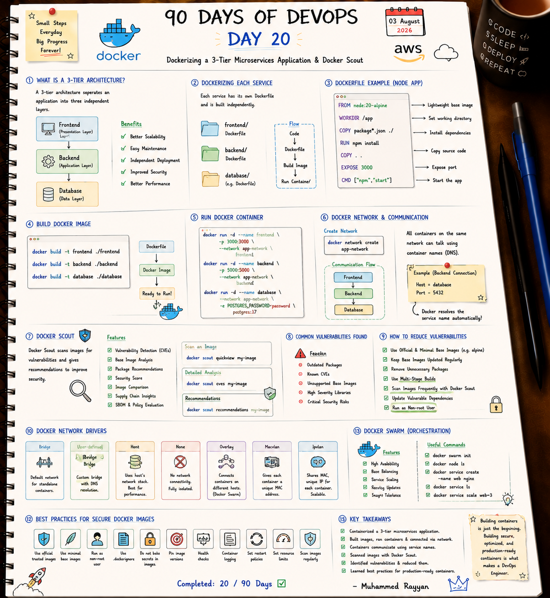

# 🏗️ Day 20: Dockerizing a 3-Tier Microservices Application & Docker Scout

On Day 20, I containerized a complete 3-Tier microservices application (Frontend React, Backend Node/Express, PostgreSQL Database), interconnected services using custom bridge networks, analyzed image security using **Docker Scout**, and explored image hardening best practices.

---

## 📝 Day 20 Notes (Visual)


---

> [!NOTE]
> **Day 20 Summary (Social Media Caption):**
> Day 20 of my 90 Days of DevOps challenge is complete! Packaging a full 3-Tier application into isolated, secure containers connected over a private bridge network is where DevOps meets real-world software engineering.
> 
> **Key Achievements:**
> * **🏗️ 3-Tier Containerization:** Frontend (3000), Backend API (5000), Database (5432).
> * **🌐 Network DNS:** Connected services on `app-network` so containers resolve via service name (`Host: database`).
> * **🔍 Docker Scout:** Scanned container images for CVE vulnerabilities and applied mitigation recommendations.
> * **🔒 Image Hardening:** Multi-stage builds, non-root users (`USER node`), and minimal base images (`alpine`).

---

## 1. 3-Tier Application Network Flow

```
[ User Browser ]
       | Port 3000:3000
       v
[ Frontend Container ] -- (Node/React)
       |
       | Network DNS: http://backend:5000
       v
[ Backend Container ]  -- (Node/Express API)
       |
       | Network DNS: database:5432
       v
[ Database Container ] -- (PostgreSQL 17)
```

---

## 2. Docker Security Best Practices

1. **Use Minimal Base Images:** Switch from `node:20` (1GB) to `node:20-alpine` (~170MB) to reduce attack surface.
2. **Run as Non-Root User:** Add `USER node` or `USER 10001` in Dockerfiles to prevent container breakout exploits.
3. **Multi-Stage Builds:** Separate compile-time build tools (compilers, npm modules) from runtime release artifacts.
4. **Use `.dockerignore`:** Exclude `node_modules`, `.env`, `.git`, and build logs from image layers.

---

## 🛠️ Executable Practice Script

* **Docker Scout Vulnerability Inspector:** [docker_scout_audit.sh](docker_scout_audit.sh)

```bash
chmod +x docker_scout_audit.sh
./docker_scout_audit.sh
```

---

### 👤 Author / Contact
* **Muhammad Rayyan** | [GitHub](https://github.com/rayyankhan-devops) | [LinkedIn](https://www.linkedin.com/in/muhammad-rayyan-5645b1317/)

---

* [← Day 19: Volumes & Networking](../day-19-docker-volumes-networking/README.md) | [Home](../README.md)
