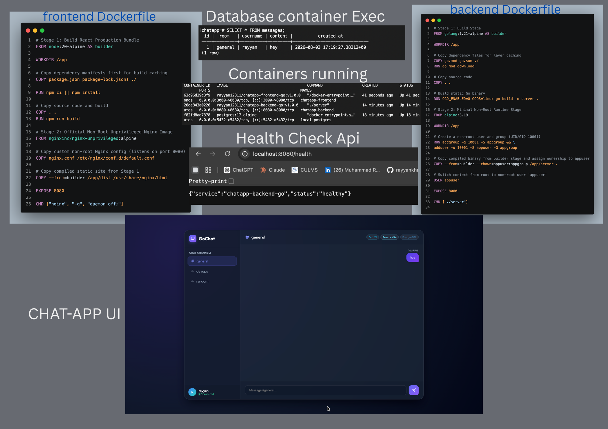
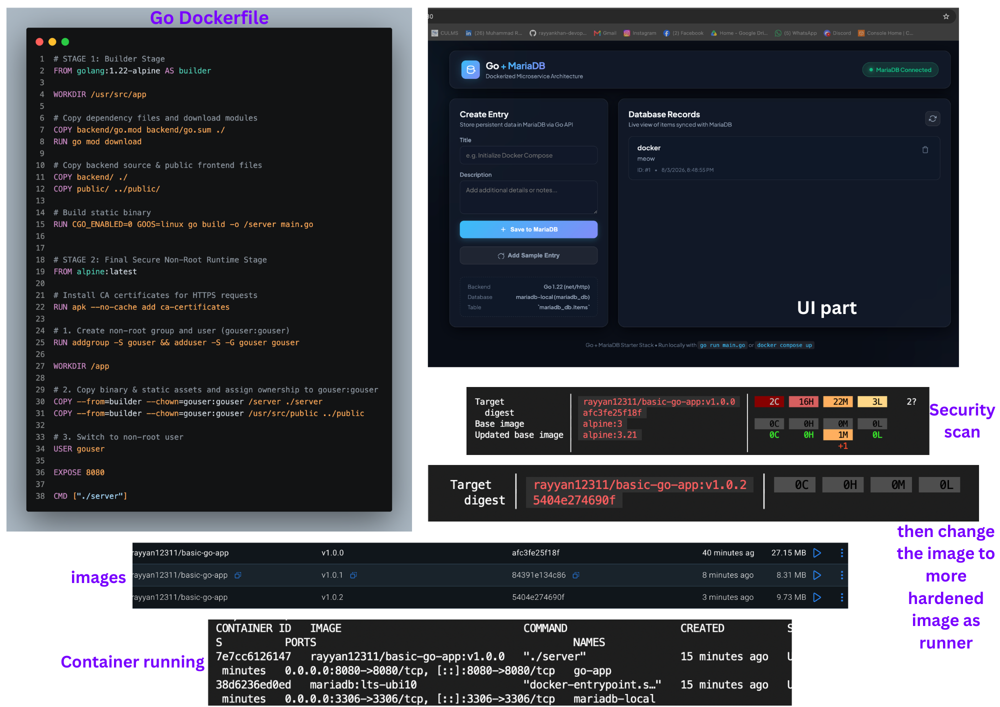

# 🐋 Day 21: Dockerfiles & Best Practices (Hands-on Projects)

On Day 21, I focused on writing production-grade, secure, multi-stage Dockerfiles, optimizing layer caching, stripping bloated dependencies, enforcing non-root container users, and deploying two real-world application stacks.

---

## 📝 Day 21 Notes (Visual)



---

> [!NOTE]
> **Day 21 Summary (Social Media Caption):**
> Day 21 of my 90 Days of DevOps challenge is complete! Writing a Dockerfile is easy—writing a secure, fast-building, and tiny 15MB production Dockerfile takes real engineering discipline!
> 
> **Key Concepts:**
> * **🏗️ Multi-Stage Builds:** Separated build SDK environments from minimal runtime images (`scratch` / `alpine`).
> * **⚡ Layer Caching:** Ordered Dockerfile instructions to leverage Docker build cache efficiency.
> * **🔒 Security Hardening:** Non-root execution (`USER appuser`), `.dockerignore`, zero hardcoded secrets.

---

## 🛠️ Hands-on Projects Included

### 1. `chatApp-go-with-react-postgres/`
A multi-tier WebSocket chat platform built with:
* **Backend:** Go (Golang) REST & WebSocket API with multi-stage Dockerfile compile targets.
* **Frontend:** React SPA built using Node and served via optimized Nginx static container.
* **Database:** PostgreSQL persistent store.

### 2. `go-with-maria-db/`
A Go microservice interacting with a MariaDB database:
* Compares `Dockerfile` (standard build) vs `Dockerfile.secure` (hardened multi-stage non-root build).

---

## 🚀 How to Run the Projects

### Running `go-with-maria-db`
```bash
cd day-21-dockerfiles-best-practices/go-with-maria-db
# Build secure multi-stage image
docker build -f Dockerfile.secure -t go-mariadb-app:latest .
```

### Running `chatApp-go-with-react-postgres`
```bash
cd day-21-dockerfiles-best-practices/chatApp-go-with-react-postgres
# Inspect backend & frontend Dockerfiles
cat backend/Dockerfile
cat frontend/Dockerfile
```

---

### 👤 Author / Contact
* **Muhammad Rayyan** | [GitHub](https://github.com/rayyankhan-devops) | [LinkedIn](https://www.linkedin.com/in/muhammad-rayyan-5645b1317/)

---

* [← Day 20: 3-Tier App & Scout](../day-20-3tier-docker-scout/README.md) | [Home](../README.md)
