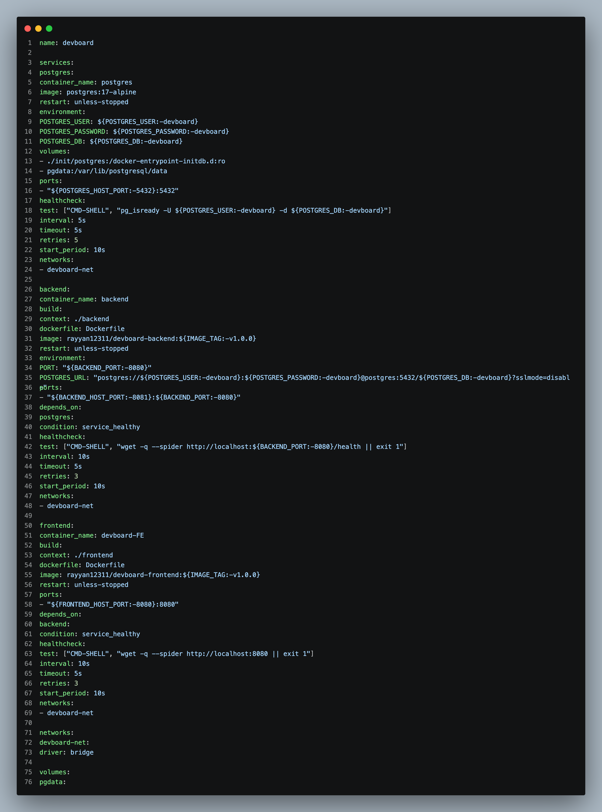
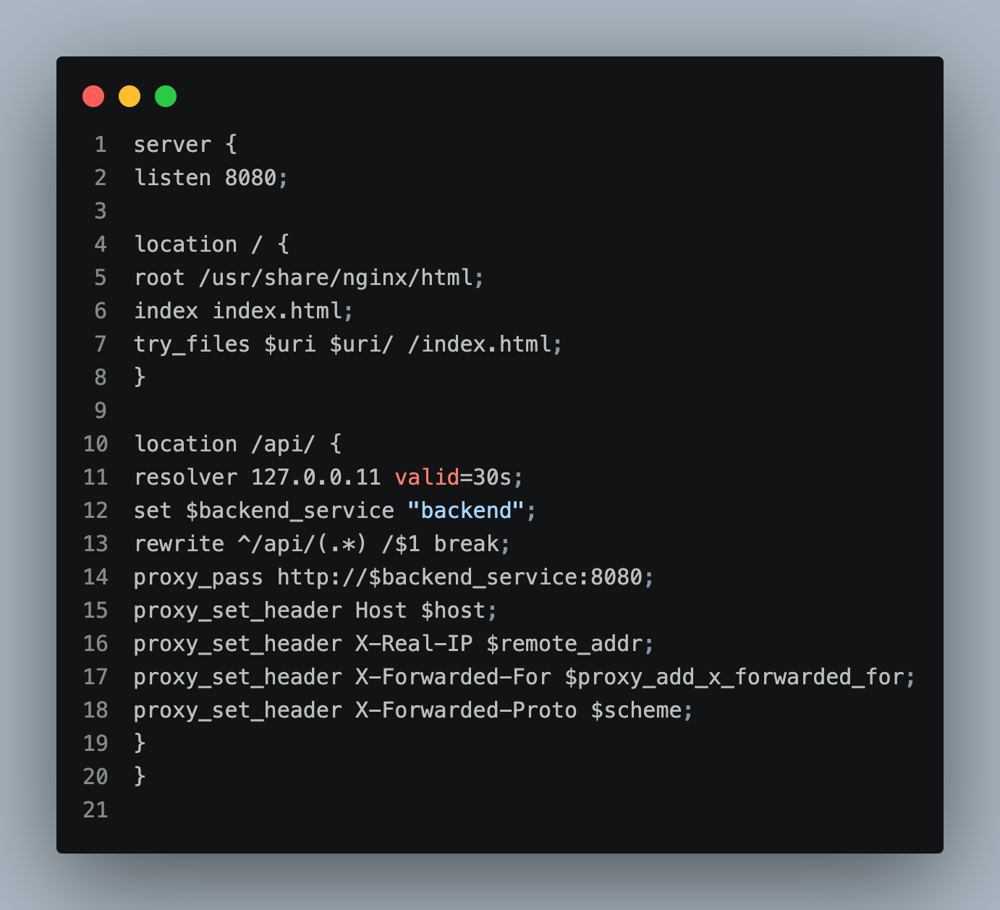
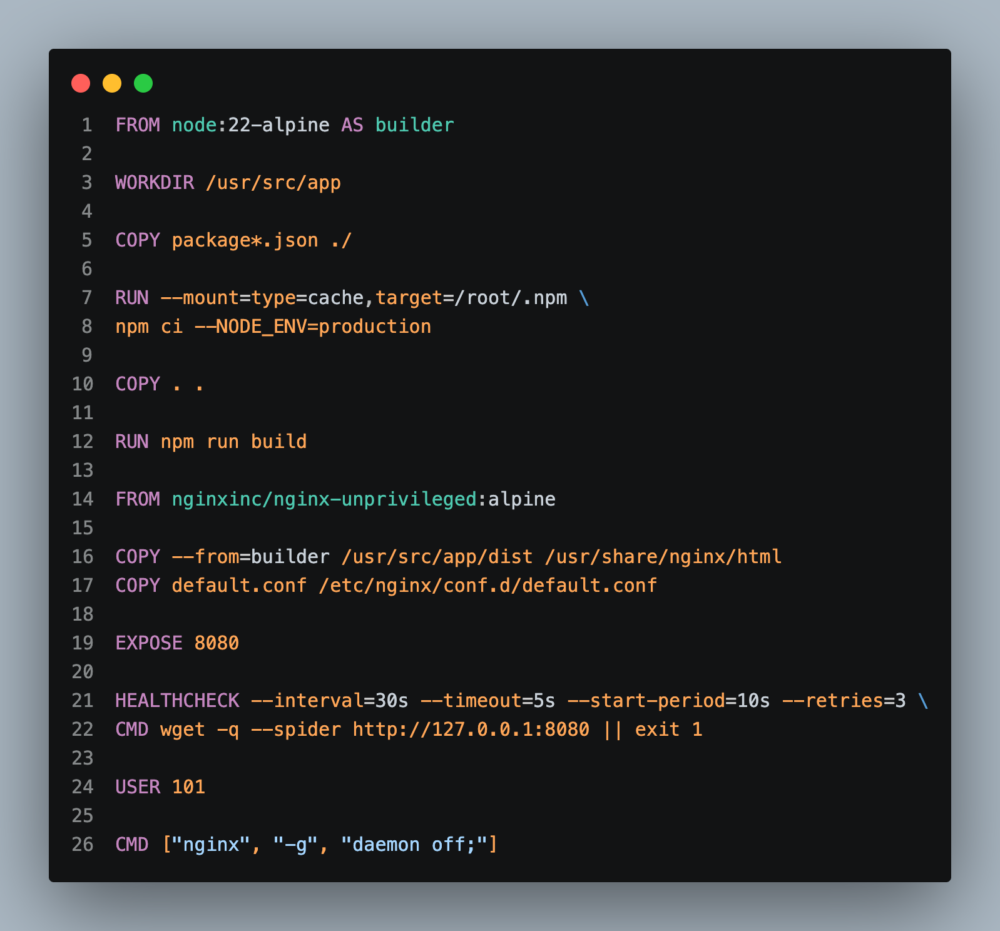
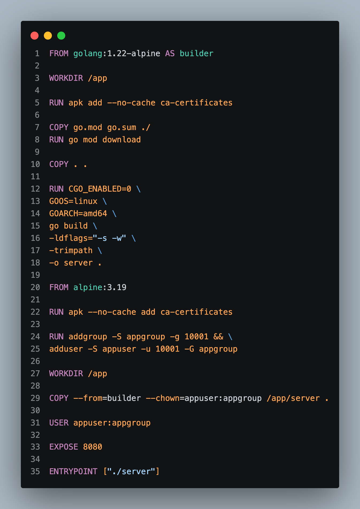

# 🐙 Day 22: Docker Compose & Microservices Stack (DevBoard Project)

On Day 22, I mastered multi-container orchestrations using **Docker Compose**, building and orchestrating a full-stack microservice platform named **DevBoard** containing Go Backend services, React Frontend, PostgreSQL database, health checks, dependency constraints, and custom bridge networks.

---

## 📝 Day 22 Notes (Visual)





---

> [!NOTE]
> **Day 22 Summary (Social Media Caption):**
> Day 22 of my 90 Days of DevOps challenge is officially in the books! Instead of launching containers manually with complex `docker run` parameters, Docker Compose allows declaring an entire multi-service stack in a single `docker-compose.yml` file!
> 
> **Key Architecture Highlights:**
> * **🐙 Multi-Container Stack:** DevBoard PostgreSQL 17 DB, Go REST API Backend, React Frontend Nginx Proxy.
> * **🚦 Health Checks & Dependencies:** Enforced `depends_on: condition: service_healthy` so backend waits for DB readiness.
> * **💾 Volume Persistence:** Configured `pgdata` volume to preserve database records across container restarts.

---

## 🏗️ DevBoard Microservices Architecture

```
[ User Browser ]
       |
       v  Port 8080
[ devboard-FE (React + Nginx) ]
       |
       v  Port 8081 (Internal DNS: http://backend:8080)
[ backend (Go REST API) ]
       |
       v  Port 5432 (Internal DNS: postgres:5432)
[ postgres (PostgreSQL 17 DB) ]
```

---

## 🚀 How to Run the DevBoard Stack

```bash
cd day-22-docker-compose-devboard/devboard

# 1. Start all microservices in background
docker compose up -d --build

# 2. Check active containers and health status
docker compose ps

# 3. View live logs across all services
docker compose logs -f

# 4. Tear down stack and remove volumes
docker compose down -v
```

---

### 👤 Author / Contact
* **Muhammad Rayyan** | [GitHub](https://github.com/rayyankhan-devops) | [LinkedIn](https://www.linkedin.com/in/muhammad-rayyan-5645b1317/)

---

* [← Day 21: Dockerfiles Best Practices](../day-21-dockerfiles-best-practices/README.md) | [Home](../README.md)
