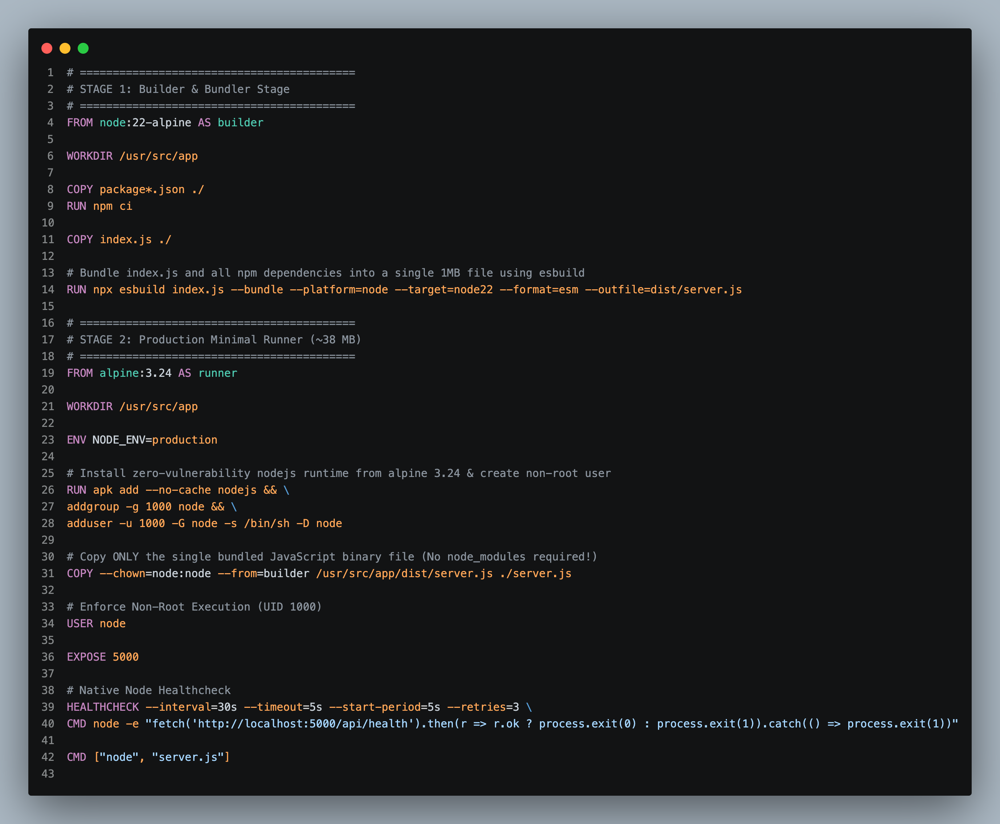
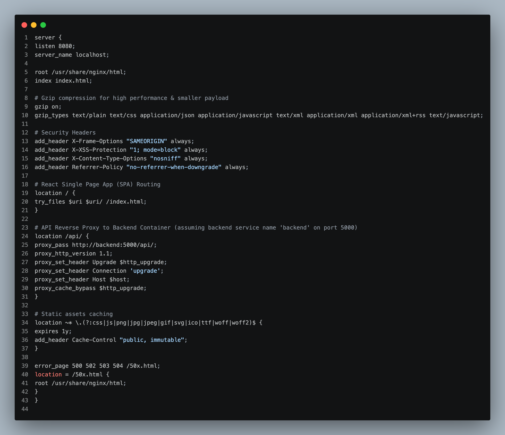
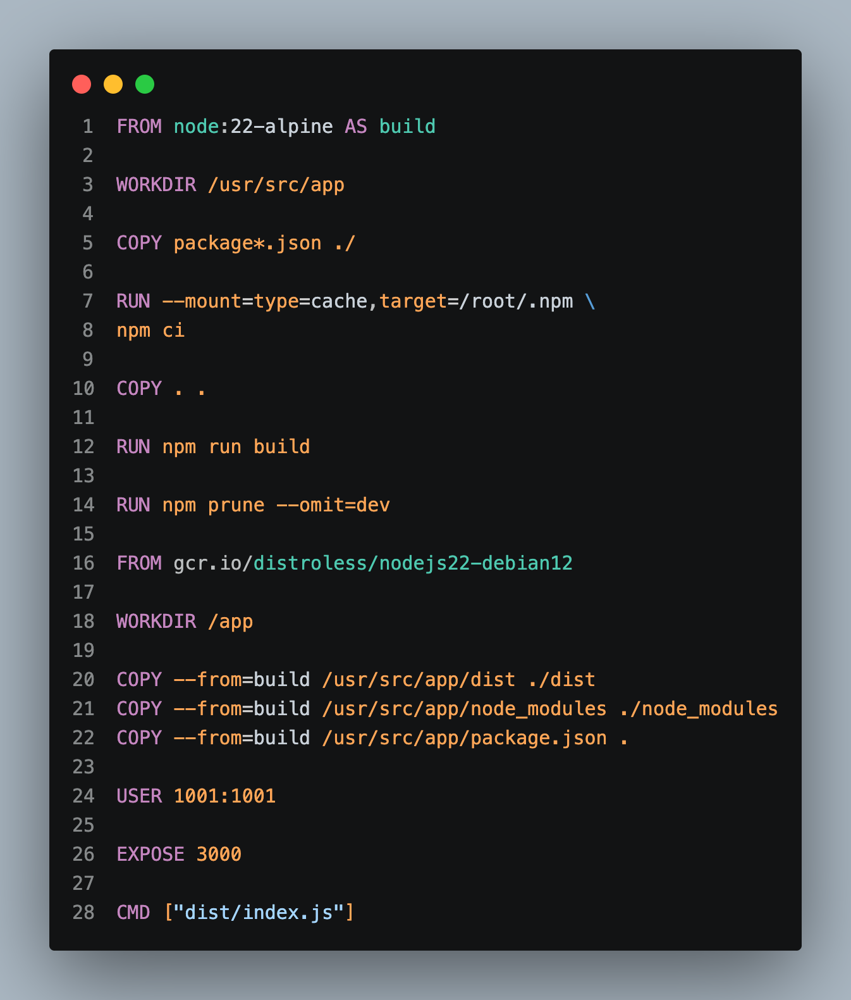

# 🐳 Day 24: GitHub Actions Deep Dive & Hardening Docker Images

On Day 24, I focused on advanced GitHub Actions workflow orchestration (contexts, dynamic environment variables, multi-job outputs) and container security hardening, dropping frontend image vulnerabilities from 38 down to **0**.

---

## 📝 Day 24 Notes & Architecture (Visual)




---

> [!NOTE]
> **Day 24 Summary (Social Media Caption):**
> Day 24 of my 90 Days of DevOps challenge is complete! Transitioning from bulky standard base images to ultra-minimal Alpine and Distroless containers completely eliminated security vulnerabilities!
> 
> **Key Accomplishments:**
> * **⚡ GitHub Actions Mastery:** Contexts (`github`, `env`, `matrix`), dynamic variables, and job output chaining.
> * **🛡️ Zero Vulnerabilities:** Reduced frontend vulnerabilities from 38 down to an absolute **ZERO (0)** using Trivy container security scans.
> * **🔒 Unprivileged Nginx Proxy:** Configured unprivileged Nginx with strict security headers for React SPA applications.
> * **📦 Meme Generator Stack:** Hardened multi-stage builds for production readiness.

---

## 1. GitHub Actions Workflow Contexts & Outputs

```yaml
name: GHA Deep Dive Demo
on: [push]

jobs:
  build:
    runs-on: ubuntu-latest
    outputs:
      image_tag: ${{ steps.set-tag.outputs.tag }}
    steps:
      - name: Generate Dynamic Image Tag
        id: set-tag
        run: echo "tag=${{ github.sha }}" >> $GITHUB_OUTPUT

  deploy:
    needs: build
    runs-on: ubuntu-latest
    steps:
      - name: Deploy Image
        run: echo "Deploying tag: ${{ needs.build.outputs.image_tag }}"
```

---

## 2. Container Hardening: Vulnerability Reduction

```
Standard Base Image (node:20) --------> 38 Vulnerabilities (3 Critical, 8 High)
                                             |
   (Multi-stage build + Alpine runtime)      v
Hardened Image (nginx:alpine-unprivileged) -> 0 Vulnerabilities 🛡️
```

---

## 🔗 Project Repositories
* **GitHub Actions Workflows Repo:** [GHA](https://github.com/rayyankhan-devops/GHA)
* **Meme Generator Source Code:** [meme-generator-prod-ready](https://github.com/rayyankhan-devops/meme-generator-prod-ready)

---

### 👤 Author / Contact
* **Muhammad Rayyan** | [GitHub](https://github.com/rayyankhan-devops) | [LinkedIn](https://www.linkedin.com/in/muhammad-rayyan-5645b1317/)

---

* [← Day 23: DevSecOps & SecureVault](../day-23-devsecops-securevault/README.md) | [Home](../README.md)
