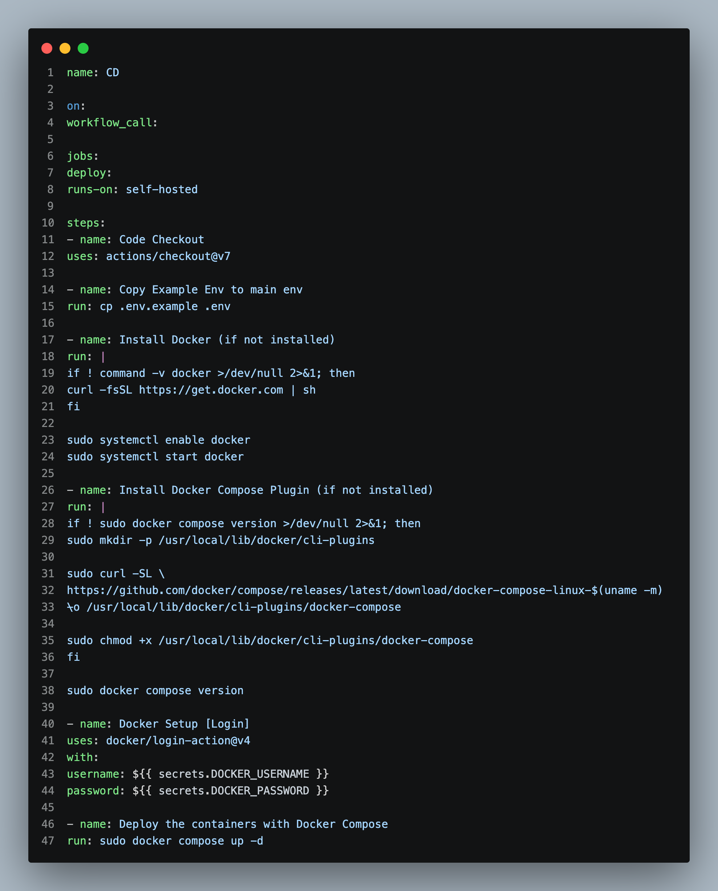
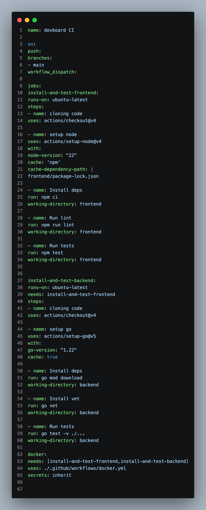
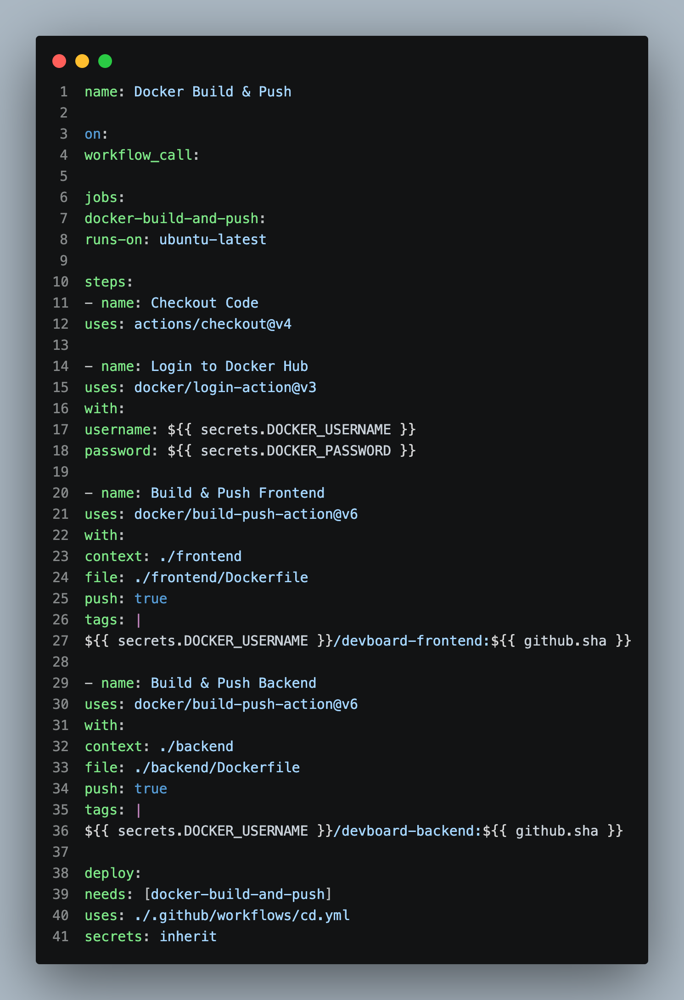

# 🚀 Day 25: End-to-End Automated CI/CD & Self-Hosted Deployment for DevBoard

On Day 25, I built a production-grade automated CI/CD pipeline for **DevBoard MVP** (a Kanban-style task management app) using GitHub Actions, Docker Hub registry, SHA-based image versioning, and an AWS EC2 self-hosted GitHub Actions runner.

---

## 📝 Day 25 Pipeline & Architecture (Visual)





---

> [!NOTE]
> **Day 25 Summary (Social Media Caption):**
> Day 25 of my 90 Days of DevOps challenge is complete! Today's accomplishment was connecting the entire software delivery lifecycle—from Git push → automated CI tests → Docker image build → Docker Hub registry → self-hosted AWS EC2 runner CD deployment!
> 
> **Key Metrics & Results:**
> * **🧪 Multi-Job CI Pipeline:** React (Node.js 22) & Go (1.22) automated linting, dependency caching, and unit testing.
> * **📦 SHA-Based Image Versioning:** Dynamically tagged Docker images using `${{ github.sha }}` pushed to Docker Hub.
> * **☁️ Self-Hosted AWS EC2 Runner:** Configured EC2 instance runner and resolved `/var/run/docker.sock` socket permissions.
> * **🟢 Pipeline Execution Time:** **9 minutes 51 seconds** (Completely Green Pipeline).

---

## 1. End-to-End Pipeline Workflow Architecture

```
[ Git Push to main ]
         |
         v
[ GitHub Actions CI Workflow ]
   ├── Job 1: Test Frontend (React / Node.js 22)
   ├── Job 2: Test Backend  (Go 1.22)
   └── Job 3: Build & Push Docker Images to Docker Hub
               ├── frontend:sha-a1b2c3d
               └── backend:sha-a1b2c3d
         |
         v
[ Self-Hosted AWS EC2 Runner (CD Workflow) ]
   ├── Step 1: Provision dynamic .env configuration
   ├── Step 2: Authenticate to Docker Hub
   └── Step 3: Run 'docker compose up -d'
         |
         v
[ Live DevBoard Application Active on AWS EC2 ]
```

---

## 2. Real-World Troubleshooting: Docker Socket Permissions

On self-hosted Linux runners, running `docker compose` inside GitHub Actions jobs throws permission errors when accessing `/var/run/docker.sock`.

### Fix:
```bash
# Add the runner system user to the docker group on the EC2 runner host
sudo usermod -aG docker github-runner
sudo chmod 666 /var/run/docker.sock
sudo systemctl restart docker
```

---

## 🛠️ GitHub Actions Workflow Inspection

Explore the workflow files inside the DevBoard project:
* **CI Test & Build Workflow:** [devboard/.github/workflows/ci.yml](devboard/.github/workflows/ci.yml)
* **CD Self-Hosted Deployment Workflow:** [devboard/.github/workflows/cd.yml](devboard/.github/workflows/cd.yml)

---

### 👤 Author / Contact
* **Muhammad Rayyan** | [GitHub](https://github.com/rayyankhan-devops) | [LinkedIn](https://www.linkedin.com/in/muhammad-rayyan-5645b1317/)

---

* [← Day 24: GitHub Actions & Docker Hardening](../day-24-gha-docker-hardening/README.md) | [Home](../README.md)
